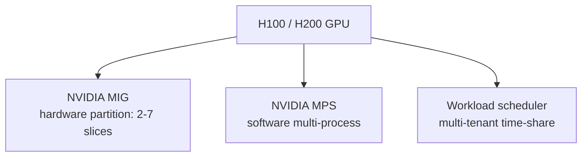
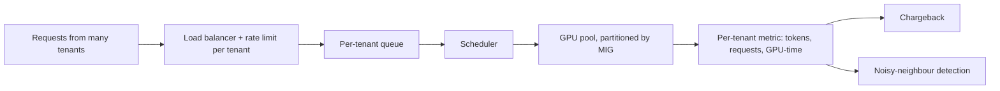
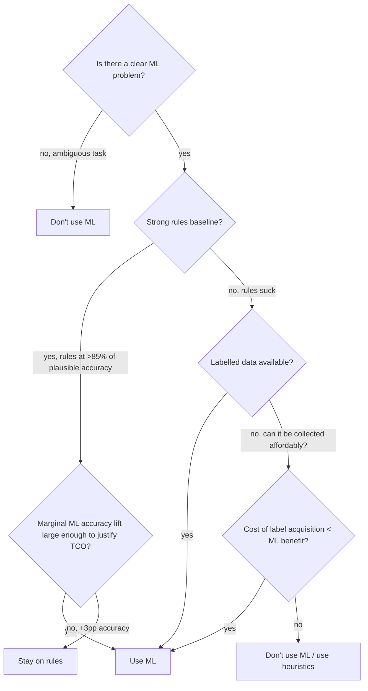

# 12 — Cost, Multi-tenancy, Scaling

> Time budget: 90 minutes. Cost discipline separates ML systems that ship from ones that get cancelled. This module hands you the unit economics.

**By the end you can:**

1. Compute the unit economics of an ML feature (cost per request, cost per user).
2. Design GPU pooling and fractional GPU usage (MIG, MPS, serverless).
3. Build a multi-tenant inference platform with noisy-neighbour and fairness controls.
4. Apply scaling laws (Kaplan 2020, Chinchilla 2022) to your training budget.
5. Articulate when not to use ML — the most under-taught topic.

---

## 1. Unit economics of an ML feature

Per-request cost decomposed:

| Component | Driver | Typical share (online recsys) | Typical share (RAG) |
|-----------|--------|-------------------------------|-----------------------|
| Feature reads | KV store ops | 5-15% | 1-3% |
| Retrieval (ANN) | Vector DB ops | 2-5% | 2-5% |
| Inference compute | GPU / CPU time | 60-80% | 70-90% (LLM dominates) |
| Logging + telemetry | Object storage + Kafka | 2-5% | 1-3% |
| Network egress | Bytes out to client | 1-5% | 1-5% |
| Everything else | Misc | 5-15% | 1-5% |

A useful framing: a feature's cost per request times the feature's expected requests per user equals the cost per user. Multiply by users, and you have the steady-state monthly bill.

See [`../calculators/recsys-cost.ipynb`](../calculators/recsys-cost.ipynb) and [`../calculators/rag-tco.ipynb`](../calculators/rag-tco.ipynb) for parametric models.

### Cost-aware product design

Some product decisions look free but cost real money:

| "Free" decision | Hidden cost |
|------------------|--------------|
| "Show recs on every page load" | Doubles request volume vs "show on home only." |
| "Refresh every 5 seconds" | Stale request from cache becomes a fresh inference. |
| "Top 50 results" | More items to score; more ranker compute. |
| "Stream the LLM response" | Roughly free, but tail latency now includes the full output, not just first token. |
| "Show 'similar to this' on every item page" | Multiplies retrieval calls per session. |

Tracking per-request cost as a first-class metric (alongside latency and quality) is the discipline that catches these.

---

## 2. GPU pooling and fractional GPUs

A typical inference model occupies 20-40% of a GPU's compute and 30-60% of its memory. Reserving a whole GPU per model wastes the rest. Three tools:

### MIG (Multi-Instance GPU)

Hardware partitioning of A100 / H100 / H200 into up to 7 slices, each with its own VRAM, SMs, and memory bandwidth.

| MIG profile (H100) | VRAM | Compute fraction |
|---------------------|------|-------------------|
| 1g.10gb | 10 GB | ~1/7 |
| 2g.20gb | 20 GB | ~2/7 |
| 3g.40gb | 40 GB | ~3/7 |
| 4g.40gb | 40 GB | ~4/7 |
| 7g.80gb | 80 GB | full GPU |

Strict isolation: a busy neighbour can't slow you down. The trade-off: profiles are static; can't merge slices once allocated.

### MPS (Multi-Process Service)

Software-level GPU sharing. Multiple processes share a single CUDA context; less isolation than MIG, more flexibility.

### Workload-level sharing

The orchestrator (K8s + Volcano / Kueue, or a custom scheduler) packs multiple inference jobs onto the same GPU. Each job gets a time share. Works well for batchable workloads.

### When to use what

| Use case | Tool |
|----------|------|
| Multi-tenant inference platform | MIG: hard isolation, easy chargeback. |
| Single-team multi-model inference | MPS or workload-level sharing. |
| LLM serving at scale | Whole GPU per replica (KV cache eats memory). |
| Dev / experiment cluster | Workload sharing with quotas. |

---

## 3. Serverless inference

Hyperscalers offer "serverless GPU inference" (SageMaker Serverless, GCP Vertex AI Endpoints, Modal, Replicate, RunPod). The model lives in storage; a GPU is provisioned per request (or for a brief warm window).

| Property | Self-managed GPU | Serverless |
|----------|-------------------|------------|
| Cold start | Slow (60-300s + model load) | Same problem, vendor-managed |
| Per-request cost | Low when utilised | Higher per request |
| Idle cost | Real | Zero (or near-zero) |
| Operational cost | Real | Near-zero |
| Throughput ceiling | Whatever you provision | Vendor-imposed |

The economics: serverless wins when utilisation is low (< 30%) or spiky. Self-managed wins at high steady-state utilisation. For LLM-style inference with persistent KV cache and continuous batching, serverless lags because cold starts are hostile to the workload model.

---

## 4. Multi-tenancy

Hosting multiple teams' models on shared infrastructure introduces fairness, isolation, and accounting concerns.

| Concern | Solution |
|---------|----------|
| **Noisy neighbour** | MIG partitioning; per-tenant rate limits; QoS on the queue. |
| **Fairness** | Weighted fair queueing; tenant priority tiers. |
| **Accounting** | Per-tenant per-request telemetry (GPU-seconds, tokens, memory). |
| **Quota** | Hard caps per tenant per window; soft alerts before hard cap. |
| **Cold start amortisation** | Shared warm pool; tenant identification at the routing layer, not the model layer. |

A pragmatic multi-tenant inference platform has:

- One model registry shared across tenants (with namespacing).
- Per-tenant inference replicas for the largest tenants; MIG-shared replicas for smaller tenants.
- A control plane that handles tenant-level concerns (rate limiting, quota, billing) so the data plane (model server) doesn't have to.

---

## 5. Scaling laws and what they mean for training budgets

Two landmark papers:

| Paper | Year | Finding |
|-------|------|---------|
| **Scaling Laws for Neural Language Models** (Kaplan et al., OpenAI) | 2020 | Loss scales as a power law in compute, parameters, and data; suggests bigger models. |
| **Training Compute-Optimal Large Language Models** (Hoffmann et al., DeepMind — "Chinchilla") | 2022 | Kaplan undersamples data; compute-optimal point is ~20 tokens per parameter, not the smaller ratios Kaplan implied. |

The Chinchilla rule of thumb: for a fixed compute budget, train on ~20 tokens per parameter. A 7B-parameter model wants ~140B tokens; a 70B model wants ~1.4T tokens. Going below ratio = under-trained; going above = wasted parameters.

What this means for budgets:

- A fixed-budget pre-training run has a specific compute-optimal parameter count.
- Inference cost scales with parameters; training cost scales with compute.
- For models that will serve heavy inference, **over-train on more data** beyond Chinchilla-optimal — a smaller, more-trained model serves inference cheaper.

The 2023-2025 wave of "Llama 3 trained on 15T tokens" or "Llama 4 on 30T tokens" reflects this: inference economics push models well past Chinchilla-optimal for the same training budget.

---

## 6. When not to use ML — the most under-taught topic

The decision tree:

A reasonable framing: ML adds infrastructure cost (training pipeline, monitoring, retraining, ownership) that's roughly equivalent to a half-FTE for any non-trivial production model. The marginal benefit has to clear that bar.

The most common honest answer: a rules-based system at 85% accuracy beats an ML system at 91% accuracy if the ML system requires four people to maintain and the rules system requires zero.

Worth using ML:

- High-volume decisions where small accuracy lifts have large business value.
- Problems with abundant labels and stable distributions.
- Problems where the rules-based approach genuinely caps out below the threshold of usefulness.

Not worth ML:

- Low-volume decisions.
- Problems where the rules baseline is already at the product-needed accuracy.
- Problems where the labels are noisy / sparse / expensive.
- Problems where the world changes faster than your retraining cadence.

The discipline is to **make this analysis explicit** before starting an ML project, not after the system is in production and somebody asks "why did we build this?"

---

## 7. Cost optimisation playbook

A typical ML system bill, ranked by leverage:

| Lever | Effort | Savings |
|-------|--------|---------|
| **Reduce request count** (cache, dedup, batch where you don't need real-time) | Low | 20-50% |
| **Smaller / quantized model** | Medium | 30-70% |
| **Right-size GPU / instance class** | Low | 20-40% |
| **Spot / preemptible for training** | Medium (need checkpointing) | 50-80% on training bill |
| **Prompt cache hit ratio (LLM)** | Medium | 30-70% on input tokens |
| **Cap output tokens (LLM)** | Low | 30-60% on output tokens |
| **Model routing (cheap for easy queries)** | Medium | 30-60% |
| **GPU pooling (MIG)** | Medium | 30-50% on GPU bill at low utilisation |
| **Negotiate with cloud vendor at scale** | Low (eventually) | 15-40% |
| **Move to colocation / on-prem** | High | Maybe 50% steady-state |

Always start with request count; you save the most by not doing the work in the first place.

---

## 8. Cross-links

- [`cheat-sheet.md`](./cheat-sheet.md)
- [`exercises.md`](./exercises.md)
- [`pitfalls.md`](./pitfalls.md)
- [`case-studies/`](./case-studies/)
- Training economics: [03 Training Infra](../03-training-infra/README.md), [`../calculators/gpu-cost.ipynb`](../calculators/gpu-cost.ipynb)
- Serving economics: [04 Serving](../04-serving-online-batch-streaming/README.md)
- RAG cost: [`../calculators/rag-tco.ipynb`](../calculators/rag-tco.ipynb)
- Up next: [13 Privacy, Fairness, Ethics](../13-privacy-fairness-ethics/README.md)

## Sources

- "Scaling Laws for Neural Language Models," Kaplan et al. (OpenAI, 2020).
- "Training Compute-Optimal Large Language Models (Chinchilla)," Hoffmann et al. (DeepMind, 2022).
- NVIDIA Multi-Instance GPU documentation, current release.
- "Sky Computing: Vision for a New Cloud Computing Paradigm," Stoica & Shenker (HotOS 2021).
- "Llama 3" and "Llama 4" technical reports (Meta, 2024-2025).
- Anyscale / Modal / Replicate engineering posts on serverless GPU economics (2023-2025).
