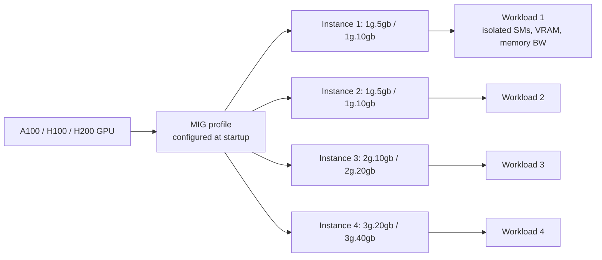

# NVIDIA — Multi-Instance GPU (2020-2024)

## Problem

By 2020, the A100 launched with 40 GB of HBM and substantial compute. Many inference workloads used a fraction of that capacity; dedicating an entire A100 to a small model wasted the rest. NVIDIA introduced MIG to let one physical GPU be partitioned into multiple hardware-isolated instances.

## Architecture

Each instance has dedicated SMs, dedicated VRAM, and dedicated memory bandwidth. A noisy neighbour cannot slow you down because they don't share the partition.

## Three load-bearing decisions

1. **Hardware isolation.** Unlike software-level GPU sharing (MPS), MIG instances cannot interfere with each other in compute or memory bandwidth.
2. **Static profile.** The MIG profile is fixed at GPU initialisation; you can't dynamically resize.
3. **K8s integration.** The NVIDIA device plugin exposes MIG instances as discrete schedulable resources.

## What didn't translate cleanly

- **Workload size mismatch.** A workload that occasionally needs more memory than its slice has fails; there's no spillover.
- **Profile choice.** Picking the right MIG profile for a mixed-workload cluster is a hard scheduling problem; many teams end up with multiple distinct profile pools.
- **Not great for LLM serving.** LLM KV cache eats memory; you typically want a whole GPU per replica, not a slice.

## What you should steal

- The framing: **hardware isolation in shared infrastructure** is much cheaper to operate than software-level isolation. The cost is rigidity.
- Use MIG for **inference of small models** in multi-tenant environments.
- Don't use MIG for **LLM serving**, large training jobs, or workloads with spiky memory needs.

## Sources

- NVIDIA Multi-Instance GPU documentation, current release.
- "GPU Sharing Strategies for ML Inference Workloads" (NVIDIA, 2022-2024).
- Anthropic / OpenAI / cloud-vendor engineering posts on multi-tenant GPU serving, 2022-2025.
