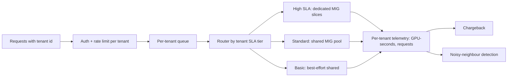

# 12 — Cost, Multi-tenancy, Scaling exercises

---

### 1. INTERVIEW. Compute cost per recommendation for a video platform at 100M DAU.

<details><summary>Solution</summary>

See [`../calculators/recsys-cost.ipynb`](../calculators/recsys-cost.ipynb) for the parametric version. Concrete walkthrough:

Assumptions:
- 100M DAU, 4 sessions/day, 20 recs/session.
- 80 feature reads per request at $0.10/M reads.
- 1 ANN call per request at $0.20/M.
- Ranker on L4 GPU, 40 ms per request, $0.55/GPU-hour.

Daily numbers:
- Requests: 100M x 4 = 400M.
- Feature reads: 400M x 80 = 32B reads -> $3,200/day.
- ANN: 400M -> $80/day.
- GPU compute: 400M x 0.040s = 16M GPU-seconds = 4,444 GPU-hours -> $2,444/day.
- Total: ~$5,700/day = ~$170k/month.

Per request: ~$0.0000143. Per 1000 recs displayed: ~$0.0007.

Levers:
- Cache session-scoped features -> halve feature reads -> save ~$1,600/day.
- Quantize ranker INT8 -> 2x throughput -> halve GPU -> save ~$1,200/day.
- Route 30% to cheap heuristic -> save ~$700/day.

Worth instrumenting; not yet an existential cost line.
</details>

---

### 2. CASE-STUDY READ. Read Chinchilla (Hoffmann et al., DeepMind, 2022). What did Kaplan's 2020 paper get wrong?

<details><summary>Solution</summary>

Kaplan et al. (OpenAI, 2020) fitted scaling laws using model size and training compute as the variables of interest, treating data as "sufficient" and not varying it carefully. Their fit suggested for a fixed compute budget, you should spend most of it on bigger models.

Hoffmann et al. (DeepMind, 2022) re-ran the experiments with data size as a first-class variable. Their finding: at Kaplan's recommended size, models are **under-trained on data**. The compute-optimal point is roughly 20 tokens per parameter, not the smaller ratio implied by Kaplan.

Practical impact: Chinchilla (70B params, 1.4T tokens) outperforms Gopher (280B params, 300B tokens) trained on the same compute. Smaller, more-trained model wins.

The 2024-2025 corollary: for models that serve heavy inference, **over-train past Chinchilla-optimal**. The training-time cost is one-time; the inference cost scales with deployed parameters; making the model smaller (by training longer) saves inference dollars forever. Meta's Llama 3 (15T tokens) and Llama 4 reports embrace this.
</details>

---

### 3. DECISION. The team wants to migrate from a 70B model to a quantized 7B for cost. Frame it.

<details><summary>Solution</summary>

Quality vs cost vs latency:

| Dimension | 70B model | 7B quantized |
|-----------|-----------|---------------|
| Quality on golden set | Baseline | Typically 5-15% worse |
| Latency | Higher | Lower |
| Cost per request | Baseline | 10-20x cheaper |
| Memory footprint | Much larger | Fits in smaller GPU |

The decision hinges on quality acceptance. If a 5-15% golden-set regression is product-unacceptable, the migration fails.

Middle paths:

1. **Distillation.** Use the 70B as teacher; train a 7B student on the teacher's outputs. Recovers most of the quality at a fraction of the inference cost.
2. **Routing.** Cheap 7B handles 60-80% of easy queries; expensive 70B handles the rest. Classifier or rule-based router. Typical savings: 50-70% total cost with small quality regression.
3. **Speculative decoding.** Use the 7B as a draft for the 70B; 1.5-3x throughput uplift on the 70B, no quality regression. Doesn't eliminate the 70B but makes it cheaper.

Recommended: routing first (cheap to ship, immediate savings), distillation second (medium-term project), full migration last (if at all).
</details>

---

### 4. INTERVIEW. Spec a multi-tenant inference platform supporting 50 teams.

<details><summary>Solution</summary>



Pieces:

- **Three tiers:** high (dedicated MIG slices, strict latency SLO), standard (shared, soft SLO), basic (best-effort).
- **Per-tenant rate limits** at the ingress.
- **Weighted fair queueing** by tenant priority.
- **Per-tenant telemetry:** every request tagged with tenant id, GPU-seconds counted, billed back.
- **MIG-based isolation** for hard SLA tenants; shared GPU pool for the rest.
- **Single control plane** owning routing, quotas, billing; data plane (model server) tenant-agnostic.

SLOs per tier:

| Tier | Latency p99 | Availability | Throughput cap |
|------|-------------|--------------|-----------------|
| High | 100 ms | 99.99% | Reserved capacity |
| Standard | 200 ms | 99.95% | Burst allowed |
| Basic | 1 s | 99.9% | Throttled |

Chargeback model: per-tenant per-GPU-second + per-tenant per-request. Tier surcharge.
</details>

---

### 5. DECISION. Your CFO says "cut the AI bill by 30%." Where do you cut first?

<details><summary>Solution</summary>

Order of operations:

1. **Profile the bill.** Where is the money going? Inference compute, training compute, storage, network, third-party APIs? The answer determines everything.
2. **Top three expensive endpoints / models / features.** Pareto.
3. For each top item, ask: **can we reduce request volume?** Caching, deduplication, batch-instead-of-real-time. This is usually the cheapest 20-40% win.
4. **Quantization / smaller models.** Often a quick 30-50% on inference.
5. **Spot / preemptible** for training. 50-80% off the training bill if jobs are checkpointable.
6. **Prompt cache + output caps** for LLM workloads. 30-70% on LLM bill.
7. **Vendor renegotiation.** At scale, the cloud bill has 15-40% headroom for negotiation.

Don't cut: monitoring, prediction logging, eval infra. These are small and they save you from worse expensive incidents.

A 30% cut is almost always feasible in 2-3 levers; deeper cuts (50%+) usually require architectural change.
</details>

---

### 6. INTERVIEW. The product team wants ML for a feature with 500 users a day. Push back.

<details><summary>Solution</summary>

Math:

- 500 users/day = ~180k decisions/year (assuming roughly one decision per user per day).
- Marginal benefit per decision = $X (whatever the business value is).
- Total ML upside = 180k x $X x lift%.

Cost of ML:

- One ML engineer half-time = ~$120k/year.
- Pipeline ops, monitoring, retraining infra = ~$30k/year minimum.
- Cloud cost = small.
- Total = ~$150k/year.

For ML to win, you need 180k x $X x lift% > $150k, i.e., $X x lift% > ~$0.83 per decision.

Whether that holds depends entirely on the business case. For a high-stakes decision (loan approval, medical triage), $0.83 of marginal value per decision is easy; for a low-stakes one (UI personalisation on a niche page), it's not.

Alternatives:

- **Rules-based.** Often delivers 70-90% of the ML benefit at near-zero ongoing cost.
- **Heuristic + manual review.** Routes the uncertain cases to a human.
- **Buy, don't build.** A hosted classifier API might serve this at $50/month.

The honest answer: build ML if the business case clears the bar; not just because it's "a problem ML can solve."
</details>

---

### 7. CASE-STUDY READ. Read Stoica & Shenker's "Sky Computing" (HotOS 2021). What does it imply for ML costs?

<details><summary>Solution</summary>

Sky Computing is the proposal that compute, like electricity, should be a fungible utility across providers. Workloads run on whichever provider is cheapest right now; cross-cloud arbitrage becomes feasible.

For ML specifically:

- **Training is the easiest case** for sky computing. Training jobs are batch, can checkpoint, and can be run on any provider with the right GPU stock.
- **Serving is harder.** Latency to users, data residency, and model warm-state all couple serving to a specific region / provider.
- **Storage gravity** still anchors data; the cost of moving petabytes between providers usually dominates the arbitrage benefit.

In 2026, the picture is partial. Multi-cloud is real but not seamless; pricing arbitrage exists for spot GPU markets (across hyperscalers + GPU-first providers like CoreWeave, Lambda, Crusoe); enterprise architectures often use a "primary cloud + burst secondary" pattern.

Practical implication: design ML systems to be portable. The cost difference between providers can be 30-50% on the same workload; over a 3-year horizon, that's material. Skipping vendor-specific features for portability is often the right trade.
</details>

---

### 8. INTERVIEW. Spec the cost monitoring you'd add to a new ML service.

<details><summary>Solution</summary>

```text
Per-request telemetry tags:
  - tenant_id
  - model_id, model_version
  - GPU-seconds consumed
  - input tokens, output tokens, cached tokens (LLM)
  - feature read count
  - retrieval calls
  - cache hit / miss for each tier

Aggregations (hourly batch job):
  - per-tenant cost: GPU-seconds * GPU $/hr + token costs + storage prorated
  - per-model cost
  - per-feature cost
  - per-endpoint cost (route)

Dashboards:
  - 30-day cost trend per dimension
  - top-N expensive routes / models / tenants
  - cost per successful request
  - cost per active user

Alerts:
  - cost per request > 2x trailing 7-day median (page)
  - daily cost > N% of budget (notify)
  - tenant burning quota (alert tenant + ops)
```

The single most important number: **cost per request**, plotted alongside latency and quality. Treat it as the third SLI of every model service.
</details>

---

### 9. DECISION. The team wants to switch from on-demand H100s to spot. Frame it.

<details><summary>Solution</summary>

Spot wins if:

- Workload tolerates preemption (training that checkpoints; non-latency-critical inference).
- Preemption rate is low enough that lost work < savings.
- Re-scheduling is fast enough that capacity is consistent.

Spot loses if:

- Workload is latency-critical serving (preemption = outage).
- Checkpointing isn't async / sharded; restart cost approaches savings.
- Region has spot supply problems (waitlists, frequent preemptions).

Numbers (illustrative, 2025-2026):

- On-demand H100: ~$3.00-4.00/hr.
- Spot: ~$1.00-2.00/hr (50-70% savings).
- Preemption rate: highly variable, 1-15% per hour depending on region / provider.

A pragmatic mix: spot for pre-training and bulk batch inference; on-demand or reserved for online serving.

Implementation requirements: async sharded checkpoints, elastic worker count, automated re-scheduling, alerting on preemption rate.
</details>

---

### 10. INTERVIEW. Articulate the case for and against on-prem ML infrastructure.

<details><summary>Solution</summary>

**Case for on-prem:**

1. At high steady-state utilisation (>60%), TCO beats cloud over 2-3 years.
2. Data residency / compliance demands it.
3. Avoiding vendor lock-in is valuable.
4. Custom hardware (e.g., AMD MI300, Habana, in-house silicon) is harder to get in cloud.
5. Network and storage tuning can be more aggressive on-prem.

**Case against on-prem:**

1. Capex burden; depreciation risk as hardware generations refresh.
2. Ops headcount: 1-2 FTE per 100-200 GPUs minimum.
3. Capacity rigidity: can't grow / shrink with demand.
4. Hardware obsolescence: Hopper-generation today, Blackwell next year.
5. Cloud-side features (managed Kubernetes, observability, identity) are real productivity wins.

The middle path: **small on-prem core + burst into cloud**. The on-prem core absorbs steady-state load; cloud handles peaks and experimentation. The org gets ~70% of the on-prem cost benefit with ~30% of the inflexibility.

Pure on-prem is rare in 2026 outside very large or highly regulated organisations. Pure cloud is the default for everyone else.
</details>

---

### 11. CASE-STUDY READ. Read NVIDIA's MIG documentation. What's the operational catch most teams miss?

<details><summary>Solution</summary>

MIG profiles are **statically configured on the GPU at startup**. You can't dynamically resize partitions while workloads are running; reconfiguration requires draining the GPU.

What this means in practice:

1. **Choose your MIG profile early** and stick with it for the lifetime of the GPU.
2. **A GPU configured for 7 x 1g.10gb can't run a single big model that needs 80 GB** without reconfiguration.
3. **Mixed-size workloads need separate GPUs** with different profiles, or workload-level scheduling on the same MIG profile.
4. **Reconfiguration is non-trivial in K8s** — the device plugin needs to expose the new profile after rolling out the change.

For multi-tenant inference: pick a profile that suits the average workload; route oversize models to a non-MIG GPU pool.

The result: many teams end up with several distinct GPU pools rather than one big pool with arbitrary partitioning. Operational reality.
</details>

---

### 12. INTERVIEW. The CTO asks "where will our ML spend be in 3 years?" Forecast.

<details><summary>Solution</summary>

Frame as drivers + trends:

**Drivers:**

1. **User growth.** Plot DAU 3-year forecast.
2. **ML feature adoption.** How many features will be ML-driven by year 3? More features = linear cost growth per user.
3. **Model complexity.** Are models getting bigger (LLM-driven)? Inference cost per request rising or falling?
4. **Training cadence.** Are you training models more often (closer to real-time)? More retrains = more training compute.

**Cost trends (2024-2026 baseline):**

- GPU $/hour roughly flat to slightly declining (new generations more efficient).
- Token prices declining 30-50% per year (intense competition).
- Storage and network roughly flat.
- Compute per dollar improving via better hardware + better inference engines.

**Hidden costs:**

- LLM bill if you adopt RAG / agents heavily.
- Ops headcount for ML platform team.
- Audit / compliance (EU AI Act, etc.).

A reasonable forecast: ML bill grows 1.5-3x over 3 years if user growth is steady and feature adoption is increasing; offset by ~30-50% efficiency gains from architecture improvements, smaller models, and price decreases. Net: 1.0-2.0x over 3 years.

That's a forecast, not a number. Show the assumptions; let the CTO move the dials.
</details>
