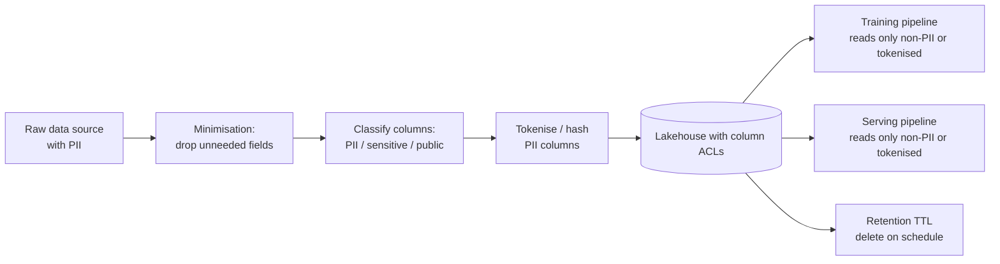
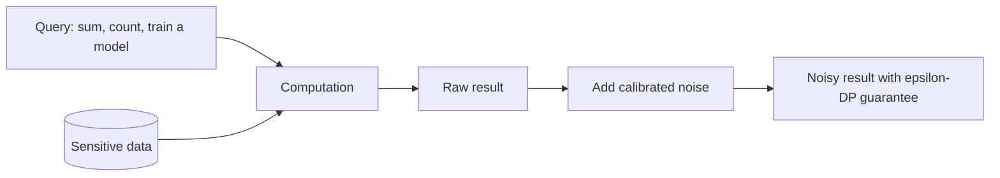
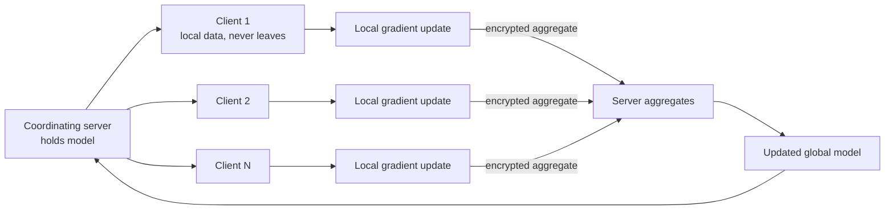
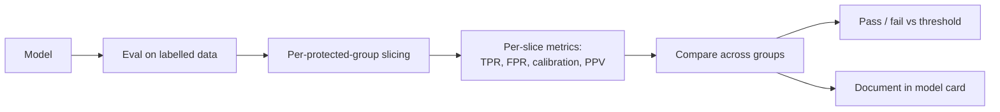
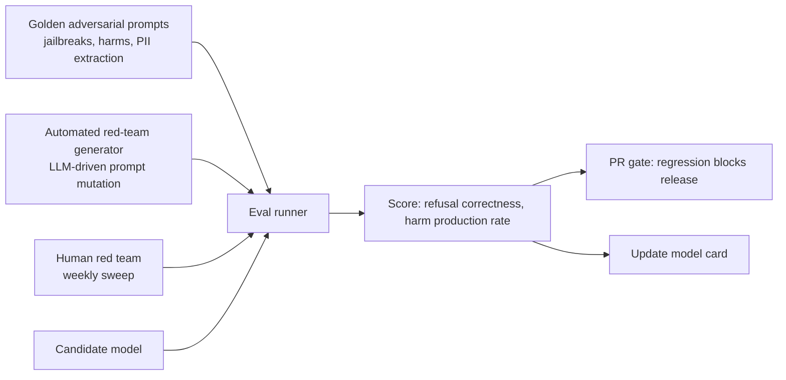

# 13 — Privacy, Fairness, Ethics

> Time budget: 60 minutes. These are not optional concerns for a systems engineer. In regulated environments they are first-class architectural drivers.

**By the end you can:**

1. Apply data-minimisation and PII handling in an ML pipeline.
2. Explain differential privacy and federated learning at a systems level.
3. Reason about fairness metrics and the impossibility theorem.
4. Map the EU AI Act, GDPR, and CCPA to concrete ML system obligations.
5. Spec a red-teaming pipeline for an LLM or recommendation system.

---

## 1. PII handling and data minimisation

The default for ML data pipelines should be: **collect the minimum needed; protect what you collect; delete what's no longer needed**.

| Practice | What it does |
|----------|--------------|
| **Drop unneeded fields at ingestion** | The cheapest privacy mitigation: don't collect it. |
| **Column-level classification** | Every column tagged: PII, sensitive, public. Determines access control. |
| **Tokenisation / hashing** | One-way transform so the model sees a stable identifier without the raw value. |
| **Differential privacy noise** at training-set generation | Mathematical guarantee that any single individual's contribution is bounded. |
| **Retention TTL** | Data deleted on schedule; not "forever by default." |
| **Audit log** | Every access to PII columns logged. |

### Why "anonymisation" usually doesn't work

The 1997 Sweeney result: 87% of Americans could be uniquely identified from (zip, birth date, sex) alone. Variants apply to any dataset rich enough to be useful for ML. Strong de-identification requires either dropping enough columns that the data is useless, or applying formal privacy guarantees (DP).

Practical guidance: don't promise users "anonymised." Promise specific protections (tokenisation, retention TTL, column ACLs) you can actually deliver.

---

## 2. Differential privacy (the systems view)

Differential privacy (Dwork et al., 2006-2014) provides a mathematical guarantee: an attacker observing the output of a query cannot determine whether any single individual was in the input.

The mechanism, in one line: **add calibrated noise to the output** of a query, where the noise is proportional to the maximum impact a single individual could have.

| Term | Meaning |
|------|---------|
| **epsilon (ε)** | Privacy budget; smaller = more private, more noise. |
| **delta (δ)** | Probability the guarantee fails; typically very small (10^-5 to 10^-7). |
| **Sensitivity** | Maximum change in the output from changing one record. |

For ML, the relevant variant is **DP-SGD** (Abadi et al., 2016): clip per-example gradients to a norm bound, add Gaussian noise, then average. The model's parameters are themselves DP-guaranteed.

Trade-offs:

- Accuracy hit: 2-10 percentage points typical for moderate epsilon.
- Compute hit: per-example gradient clipping is expensive.
- Engineering: DP frameworks (Opacus for PyTorch, TF Privacy) exist but add complexity.

Where DP is real: ad attribution (Apple, Google), federated analytics, regulated medical / financial ML.

Where DP is mostly performative: a small DP budget bolted onto a model with massive other data leakage.

---

## 3. Federated learning

The seminal paper: McMahan et al. (Google, AISTATS 2017), FedAvg. The promise: train a model over decentralised data without centralising it.

Production-grade systems combine:

- **Federated averaging** of gradients.
- **Secure aggregation** so the server never sees individual client gradients in cleartext.
- **Differential privacy** on the aggregated update.

What federated learning is good for:

- Mobile-device personalisation (Google's Gboard, Apple's on-device ML).
- Cross-organisation collaboration where data can't be shared (multi-hospital medical ML).
- Privacy-preserving analytics at scale.

What it's not good for:

- High-dimensional models on heterogeneous data — convergence is slow, expensive.
- Real-time training — round trips between server and clients are minutes-to-hours.
- Problems where centralised data is legally and ethically OK — the centralised version trains faster.

---

## 4. Fairness — vocabulary and the impossibility theorem

### Fairness definitions (a small subset)

| Definition | What it means |
|------------|---------------|
| **Demographic parity** | Same positive prediction rate across groups. |
| **Equal opportunity** | Same true-positive rate across groups. |
| **Equalised odds** | Same true-positive rate AND same false-positive rate across groups. |
| **Predictive parity / calibration** | Same precision (PPV) across groups. |
| **Individual fairness** | Similar individuals get similar predictions. |

### The impossibility theorem (Chouldechova 2017; Kleinberg et al. 2016)

When base rates differ across groups (which they almost always do in real data), you **cannot simultaneously satisfy** calibration AND equal false-positive rates AND equal false-negative rates. Pick at most two.

Practical consequence: fairness in production is a choice about which trade-off to make. A model can be "fair" by one definition and "unfair" by another, both correctly. The team has to pick which definition matters for their domain.

### Audit pipeline

This isn't optional in a regulated environment. The EU AI Act (Regulation 2024/1689, in force 2024) requires per-slice performance documentation for "high-risk" AI systems.

---

## 5. EU AI Act, GDPR, CCPA — what they actually require

### EU AI Act (in force 2024-2026 phased)

Classifies AI systems by risk:

| Tier | Examples | Obligations |
|------|----------|-------------|
| **Unacceptable risk** | Social scoring, real-time biometric ID in public (most cases) | Banned. |
| **High-risk** | Credit scoring, insurance, employment, education, law enforcement | Risk management, data governance, technical documentation, transparency, human oversight, accuracy + robustness + cybersecurity, conformity assessment. |
| **Limited risk (transparency)** | Chatbots, deepfakes, emotion recognition | Disclosure that the user is interacting with AI. |
| **Minimal risk** | Spam filters, video game AI | No additional obligations. |

For high-risk systems, the engineering implications are substantial:

- Versioned model cards and data cards.
- Documented bias / fairness evaluations.
- Human-in-the-loop mechanisms for high-stakes decisions.
- Logging sufficient for post-hoc audits.
- Reporting of serious incidents.

### GDPR (in force 2018)

For ML systems handling EU personal data:

- **Lawful basis** for processing (consent, contract, legitimate interest).
- **Purpose limitation:** the data is used only for the purpose collected.
- **Data minimisation:** collect the minimum needed.
- **Right to erasure:** users can request deletion.
- **Right to explanation** for automated decisions with significant effect.
- **Data Protection Impact Assessment** for high-risk processing.

The right-to-erasure provision interacts non-trivially with ML: removing one user's data from a trained model often requires retraining (or formal "machine unlearning" techniques, still maturing as of 2026).

### CCPA / CPRA (California, in force 2018+, expanded)

Similar to GDPR in spirit; lighter in many specifics. Right to know what data is collected, right to delete, right to opt out of sale of personal information.

### What this means for an ML team

| Item | Concrete artefact |
|------|--------------------|
| Lawful basis | Documented per data source. |
| Model card | Per model, per version, with bias eval and limitations. |
| Data card | Per dataset, with provenance, consent basis, retention. |
| Audit log | Every PII access, every model decision (for high-risk) logged with retention sufficient for regulator inquiries (typically 6-7 years for finance, 10+ for medical). |
| Deletion mechanism | Procedural and technical: how do you actually erase a user's footprint? |
| Human oversight | Defined process for the human in the loop for high-risk decisions. |

---

## 6. Red-teaming pipelines (for LLMs and beyond)

Red-teaming is the systematic adversarial probing of an ML system to discover harm vectors before adversaries do.

Anthropic and OpenAI public posts (2024-2025) describe layered red-teaming with both automated and human-driven phases. Key components:

| Component | Purpose |
|-----------|---------|
| **Golden adversarial set** | Known prompts that test known failure modes. Regression tests. |
| **Automated mutation** | LLM-driven generation of new adversarial prompts; surfaces novel failure modes. |
| **Human red team** | Domain experts probe for harms an LLM red-teamer wouldn't think of. |
| **Score function** | Did the model refuse / handle the prompt safely? |
| **Gate** | Regression blocks release; severe new failures block until mitigated. |

Red-teaming is also relevant for recsys (does the model surface harmful content?), search (does it expose PII via clever queries?), and fraud (can adversaries probe to learn thresholds?).

---

## 7. Cross-links

- [`cheat-sheet.md`](./cheat-sheet.md)
- [`exercises.md`](./exercises.md)
- [`pitfalls.md`](./pitfalls.md)
- [`case-studies/`](./case-studies/)
- Monitoring + cards: [10 Monitoring and Drift](../10-monitoring-and-drift/README.md)
- LLM evals + safety: [06 LLM Serving and RAG](../06-llm-serving-and-rag/README.md)
- Up next: [14 Case Studies Deep Dives](../14-case-studies-deep-dives/README.md)

## Sources

- "Communication-Efficient Learning of Deep Networks from Decentralized Data," McMahan et al. (Google, AISTATS 2017).
- "Deep Learning with Differential Privacy," Abadi et al. (Google, CCS 2016).
- "The Algorithmic Foundations of Differential Privacy," Dwork & Roth (2014).
- "Fair prediction with disparate impact: A study of bias in recidivism prediction instruments," Chouldechova (Big Data 2017).
- "Inherent Trade-Offs in the Fair Determination of Risk Scores," Kleinberg, Mullainathan, Raghavan (ITCS 2017).
- EU AI Act (Regulation 2024/1689).
- GDPR (Regulation 2016/679).
- CCPA (California Civil Code 1798.100 et seq., 2018+).
- "Model Cards for Model Reporting," Mitchell et al. (FAT* 2019).
- "Datasheets for Datasets," Gebru et al. (CACM 2021).
- Anthropic and OpenAI red-teaming methodology posts (2024-2025).
