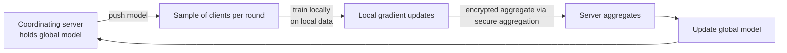

# Google — Federated learning (2017)

## Problem

In 2017, Google wanted to train ML models that improved keyboard autocorrect, predictive text, and similar on-device experiences. The training data was sensitive (literally what users were typing) and lived on millions of devices. Centralising the data was both a privacy concern and impractical at scale.

McMahan, Moore, Ramage, Hampson, Arcas (Google, AISTATS 2017) introduced Federated Averaging (FedAvg).

## Architecture

Each training "round": server pushes the current global model to a sample of clients; clients train locally on their data for a few epochs; clients send their updated model (or gradient) back; server averages.

## Three load-bearing decisions

1. **Local data never leaves the device.** Strong privacy property.
2. **Sample of clients per round.** Most devices are unavailable most of the time; the protocol tolerates partial participation.
3. **Aggregate, not individual updates.** Combined with secure aggregation (Bonawitz et al., 2017), the server cannot see any individual client's update.

## What had to be solved later

- **Heterogeneous data.** FedAvg's convergence guarantees assume IID data; real client data is non-IID. Algorithm variants (FedProx, SCAFFOLD) help but don't eliminate the issue.
- **Stragglers.** A round's slowest 10% delay the round. Asynchronous variants and tiered participation address this.
- **Byzantine robustness.** Malicious clients can submit poisoned gradients. Krum and median-based aggregators help.
- **Privacy beyond aggregate.** Aggregate alone doesn't formally bound per-individual leakage. Add DP to the aggregate.

## What you should steal

- The framing: **for cross-device or cross-org scenarios, decentralised training is feasible**. Don't assume data must centralise.
- The discipline of **clients-per-round sampling** as the right abstraction for distributed training over unreliable participants.
- The need for **layered privacy**: federation alone is not enough; combine with secure aggregation and DP for real guarantees.

## Sources

- "Communication-Efficient Learning of Deep Networks from Decentralized Data," McMahan, Moore, Ramage, Hampson, Arcas (Google, AISTATS 2017).
- "Practical Secure Aggregation for Privacy-Preserving Machine Learning," Bonawitz et al. (Google, CCS 2017).
- "Federated Learning: Challenges, Methods, and Future Directions," Li et al. (IEEE Signal Processing Magazine, 2020).
- Apple and Google privacy engineering posts on federated analytics, 2019-2024.
