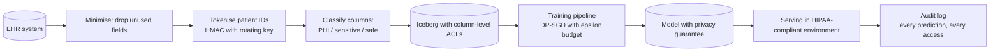

# 13 — Privacy, Fairness, Ethics exercises

---

### 1. INTERVIEW. Design a privacy-preserving ML pipeline for a healthcare classifier.

<details><summary>Solution</summary>



Specifics:

- **HIPAA-aligned environment.** Cloud BAA, encrypted at rest and in transit, restricted access.
- **Data lineage.** Every dataset traceable to consent basis.
- **DP-SGD training** with documented epsilon (e.g., epsilon=4, delta=10^-6).
- **Audit log** retained 10+ years per HIPAA.
- **Human-in-the-loop** for any decision affecting care.
- **Bias eval** per protected class (race, ethnicity, age, sex); documented in model card.
- **Deletion mechanism.** Patient deletion request triggers procedural data removal + a retraining queue.

The model card explicitly states the model's limitations (training data composition, known failure modes per cohort, intended use).
</details>

---

### 2. CASE-STUDY READ. Read McMahan et al. on Federated Averaging (Google, AISTATS 2017). What did they assume about clients that doesn't always hold?

<details><summary>Solution</summary>

The original FedAvg paper assumed:

1. **Many clients** (thousands to millions).
2. **Heterogeneous local data.** Each client has its own distribution but the joint is well-behaved.
3. **Reliable client availability** (or at least a usable fraction available per round).
4. **Roughly comparable client compute / network.**

In practice:

- **Long-tailed client distributions.** Most clients have very little data; a few have lots. FedAvg without per-client weighting biases toward heavy clients.
- **Stragglers.** A round's slowest 10% of clients delays the round.
- **Adversarial clients.** Some clients can be malicious — submit poisoned gradients to manipulate the model. Need byzantine-robust aggregation (Krum, median-based aggregators).
- **Privacy leakage from gradients.** Even encrypted aggregates can leak individual contributions; you need secure aggregation + DP on top.

The 2017 paper was the foundation; the production federated learning of 2022-2026 (Apple, Google, Brave) adds secure aggregation, DP noise, byzantine robustness, and careful client selection.
</details>

---

### 3. DECISION. The product team wants to deploy a credit-scoring model in the EU. Map the regulatory obligations.

<details><summary>Solution</summary>

Credit scoring is **high-risk** under the EU AI Act.

Required:

1. **Risk management system.** Documented analysis of risks (bias, robustness, security) and mitigations.
2. **Data governance.** Training data representativeness, error / bias analysis, documented preprocessing.
3. **Technical documentation.** Architecture, training process, evaluation, intended use, limitations.
4. **Transparency.** Decision explanations to subjects on request (GDPR's right to explanation).
5. **Human oversight.** Decisions reviewable; appeals mechanism.
6. **Accuracy + robustness + cybersecurity.** Tested; documented.
7. **Conformity assessment.** Third-party (notified body) review for some categories.
8. **Logging.** Every prediction logged for at least 6 months.
9. **Registration.** In the EU AI Act database.
10. **Incident reporting.** Serious incidents reported.

GDPR layered on top:
- Lawful basis (typically contract for credit decisions).
- Data minimisation.
- Right to explanation for the automated decision.
- DPIA (Data Protection Impact Assessment).

Practical engineering: this is a 3-6 month project of compliance engineering alongside the actual model build. Don't underestimate.
</details>

---

### 4. INTERVIEW. Explain the fairness impossibility theorem with a worked example.

<details><summary>Solution</summary>

Two groups, A and B. Base rate of positive outcome (e.g., loan default) is 10% in group A, 30% in group B.

A model produces a single score; threshold at, say, 0.5.

**Calibration:** among those scored at level X, the fraction with positive outcome equals X. Both groups can be calibrated.

**Equal false-positive rate:** among those whose true outcome is negative, the fraction predicted positive is the same in both groups.

**Equal false-negative rate:** symmetric.

Chouldechova (2017) shows: if the model is well-calibrated AND the base rates differ, then equal false-positive and equal false-negative rates cannot both hold. The math is short and decisive.

Concretely: if you tune the threshold to equalise FPR across groups, you'll have different FNR (and worse outcomes for one group). If you equalise FNR, FPR differs. If you equalise PPV (calibration), neither rate equalises.

The decision is a policy choice. For criminal sentencing, equal FPR may be the priority (don't over-detain). For credit, calibration may be (don't lend on overconfident scores). The team must pick; the regulator may pick for you.
</details>

---

### 5. DECISION. The team wants to use a hosted LLM API for processing customer support tickets that contain PII. Pros and cons?

<details><summary>Solution</summary>

Pros:
- Speed-to-market.
- High quality.
- Vendor handles infra.

Cons:
- **PII leaves your environment.** Even if the vendor promises not to train on it, you've extended your trust boundary.
- **Regulatory.** GDPR / HIPAA / CCPA may restrict cross-border data flow.
- **Audit.** Vendor logs may not be available for your auditor.
- **Data retention.** Vendor's retention may not match yours.

Mitigations:

1. **Vendor agreements:** signed BAA / DPA, no training on your data, regional data residency.
2. **PII redaction before the API call.** Replace names, addresses, phone numbers, IDs with tokens; restore in the response.
3. **Routing.** Sensitive tickets to a self-hosted model; routine ones to the API.
4. **Audit log.** Every API call logged with the tenant id and a hash of the PII handled.

For HIPAA or strictly regulated EU data: self-host. The compliance burden of vendor LLMs for high-sensitivity data is usually unfavourable.

For general customer support: hosted is fine with PII redaction + appropriate DPA.
</details>

---

### 6. CASE-STUDY READ. Read Apple's "Private Federated Learning" technical posts (2019-2023). What's their approach to combining DP with FL?

<details><summary>Solution</summary>

Apple's federated analytics combines:

1. **On-device computation.** The query runs against local data on the device.
2. **Local differential privacy.** Each device adds noise to its result before sending — guarantees hold even if the server is malicious.
3. **Secure aggregation.** The server can compute the aggregate without seeing individual contributions.
4. **Stricter local DP than central DP.** Because the server is untrusted, the per-device noise is larger; aggregation reduces noise variance proportionally to sqrt(N).

What this gives them: aggregate statistics about emoji use, keyboard auto-correct, browser usage — without ever seeing individual users' data.

What it doesn't give: training of high-quality models. Local DP is brutal for ML training; the noise destroys learning signal at typical epsilons. Apple's main use is analytics, not high-precision ML.

Lesson: pick the right privacy primitive for the workload. Aggregate statistics tolerate local DP; ML training needs centralised DP or careful federation.
</details>

---

### 7. INTERVIEW. Spec a red-teaming process for an LLM assistant.

<details><summary>Solution</summary>

```text
Layer 1 - Golden adversarial set (every PR):
  - 500 hand-curated prompts spanning known harm categories
  - Jailbreak attempts, PII extraction, harmful content, prompt injection via tool output
  - Pass criteria: model refuses or handles safely on >= 95% of cases
  - Block PR on regression

Layer 2 - Automated red-team (nightly):
  - Adversarial prompt generation via a separate LLM
  - Mutation of golden cases
  - Coverage of templated attack patterns
  - Reports new failure modes to security team

Layer 3 - Human red team (weekly):
  - Domain experts probe for harms in their area
  - Adversarial creativity beyond what LLMs generate
  - Documented findings; severity-tagged

Layer 4 - Bug bounty (continuous):
  - External researchers; rewards for novel jailbreaks
  - Disclosure policy

Score function:
  - For each prompt, did the model refuse appropriately, generate harmful content, or leak PII?
  - Aggregate score per category; per-category thresholds

Gate:
  - Severe regression blocks release
  - New failure modes added to golden set after triage
```

Anthropic and OpenAI's public posts on red-teaming (2024-2025) describe roughly this layered approach.
</details>

---

### 8. DECISION. Your CISO asks "are we GDPR-compliant for our recsys model?" What do you check?

<details><summary>Solution</summary>

Run through the checklist:

1. **Lawful basis for processing.** Most recsys runs on legitimate-interest basis; verify it's documented.
2. **Purpose limitation.** Data collected for recsys is used for recsys (and stated purposes), not silently extended.
3. **Data minimisation.** What features are collected vs needed? Audit the feature catalog.
4. **Right to erasure.** Can you actually delete a user? Procedural (drop from training set, retrain on schedule) + technical (remove from feature store, online cache).
5. **Right to explanation.** For automated decisions with significant effect — most recsys isn't "significant effect," but the boundary is fuzzy.
6. **DPIA.** Has one been done for the recsys?
7. **Audit logs.** Sufficient to answer regulator questions for the retention window.
8. **Cross-border data transfer.** If EU data flows to non-EU servers, SCCs or Adequacy decision required.

Common gaps in real teams:

- Erasure that says "we'll do it on the next retrain cycle" without committing to a SLO.
- Data minimisation absent; the feature store has 500 features, 200 of which are unused.
- DPIA never done.

The CISO needs concrete evidence; if any of the above can't be answered with a document, that's the gap to close.
</details>

---

### 9. INTERVIEW. Walk through how you'd retire a model that turned out to be biased.

<details><summary>Solution</summary>

1. **Stop the bleeding.** Roll back to the prior model (registry tag flip). Document the incident.
2. **Quantify the harm.** Per-cohort impact assessment. What populations were affected; by how much; over what time window?
3. **Inform affected stakeholders.** Internal teams, customer-facing teams. Possibly regulators and users if the harm crosses a threshold (varies by jurisdiction).
4. **Postmortem.** Why did the bias not surface in pre-launch eval? Root cause analysis on training data, evaluation, slicing.
5. **Fix.** Either retrain with bias mitigations or pull the use case entirely if it can't be fixed.
6. **Update model card and data card.** The card on the public-facing artefact reflects the issue and resolution.
7. **Compensation / remediation.** Where required by law or product equity (e.g., users wrongfully denied service).
8. **Process changes.** What evaluation gate should have caught this and didn't? Add it.

The team's response time matters. Fast rollback + transparent communication often becomes a non-event; slow response + opacity becomes a crisis.
</details>

---

### 10. DECISION. The team wants to add DP-SGD to a training pipeline. What do you measure first?

<details><summary>Solution</summary>

Before enabling DP-SGD, baseline the following:

1. **Current accuracy on golden set.**
2. **Per-cohort accuracy.**
3. **Training time and compute cost.**
4. **What sensitive attribute(s) the DP is protecting.**

Then enable DP-SGD with a chosen epsilon. Re-measure:

1. **Accuracy delta.** Typically 2-10 pp at moderate epsilon (epsilon ~ 1-8).
2. **Per-cohort delta.** DP often disproportionately affects minority cohorts (less data to wash out the noise).
3. **Training time.** Per-example gradient clipping adds 30-100% to training time.

Decision: is the accuracy / fairness cost worth the privacy guarantee?

Often the honest answer is "no" — DP-SGD is too expensive for marginal-value workloads. It's appropriate where the privacy guarantee is a regulatory requirement or where adversarial inversion attacks are a realistic threat (high-value medical, financial, advertising data).

Don't enable DP-SGD performatively. Either commit to the cost or skip it.
</details>

---

### 11. CASE-STUDY READ. Read Chouldechova (Big Data 2017) on the COMPAS controversy. What was the structural finding?

<details><summary>Solution</summary>

ProPublica's 2016 analysis of COMPAS (a risk-of-recidivism tool used in US criminal courts) found:

- Black defendants were assigned higher-risk scores at higher rates than white defendants.
- False-positive rate (defendants flagged as high-risk who didn't recidivate) was higher for Black defendants.
- COMPAS responded that the scores were calibrated — at any given score level, the recidivism rate was roughly equal across groups.

Chouldechova (2017) formalised the conflict: COMPAS was right that the scores were calibrated; ProPublica was right that the FPR / FNR differed across groups; **both can be simultaneously true** when base rates differ.

The structural finding: **fairness has multiple incompatible definitions** when base rates differ across groups. Choosing one definition is a policy decision, not a technical one. No model can be "fair by all definitions."

What this means for engineers: don't promise "fairness" without specifying which definition you're optimising. Document the choice. Acknowledge what you're not optimising. Be honest in the model card.
</details>

---

### 12. INTERVIEW. The product team wants to add "AI" to a feature in a regulated domain. What's your first question?

<details><summary>Solution</summary>

"What's the risk classification under our jurisdiction's regulation?"

Then:

1. **EU AI Act tier?** Banned / high-risk / limited / minimal.
2. **Sectoral regulator?** (FCA, OCC, FDA, banking regulator, etc.)
3. **What decision does the model affect?** Loan approval, hiring, medical, criminal justice — high stakes.
4. **Counterparties.** Is the customer aware they're interacting with an AI?
5. **Human-in-the-loop?** Required for high-risk; nice to have anyway.
6. **Existing baseline.** Is there a rules-based / human system the AI replaces? Comparative fairness analysis is required.

Often the answer is: ML adds significant compliance overhead. If the marginal accuracy benefit is small and the rules baseline is acceptable, the right answer is "don't do it; iterate on the rules instead."

If you do proceed: budget 2-6 months of compliance engineering alongside the model work. Don't promise launch dates that assume zero compliance work; you'll fail to deliver.
</details>
