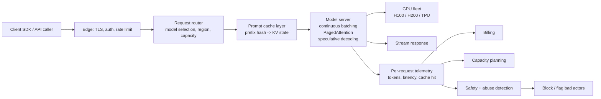

# Anthropic and OpenAI — LLM inference infrastructure (deep dive)

## Problem

Serve frontier-class LLMs to millions of users at predictable latency and cost. Both Anthropic and OpenAI face the same physics: large models, KV caches that dominate memory, decode that's memory-bandwidth-bound, prefill that's compute-bound, and a workload mix from short prompts to 200k-token contexts. The infrastructure isn't fully public — much is proprietary — but the building blocks are.

## Architecture (composite from public posts, papers, and inferable from APIs, 2023-2025)

## Three load-bearing decisions

1. **Continuous batching + PagedAttention.** Every serious LLM serving stack uses some variant of vLLM-style or Orca-style continuous batching with paged KV. Without these, throughput is 1/10 of what's possible.

2. **Prompt caching as a first-class feature.** Anthropic's 2024 launch of explicit cacheable segments, OpenAI's automatic prompt caching (2024), Google's Gemini context caching, DeepSeek's context caching — all converged on roughly the same idea: re-use prefill across requests for shared prompt prefixes. Cached input tokens are ~10% of fresh token price.

3. **Multi-region capacity with explicit overflow.** Frontier APIs face spiky demand. Region-aware routing + capacity reservations + transparent overflow to other regions (or other model versions) is how they hold latency under load.

## What's harder to see from outside

- **Speculative decoding.** vLLM and TensorRT-LLM expose it; whether Anthropic / OpenAI use it (and which variant) is mostly private. The 1.5-3x decode speedup is meaningful enough that one assumes they do.

- **Model parallelism for serving.** Frontier models don't fit on a single GPU. Tensor parallel within node + maybe pipeline parallel across nodes for the largest models. Specific configurations aren't public.

- **KV cache eviction policy.** The cache has finite memory; some policy decides which prefixes to keep. LRU-like behaviour is documented; specifics are not.

- **Safety pipelines.** Pre-prompt classifiers, post-response filters, output safety models. Layered safety is well-documented in principle; the exact production layering is not.

## What you should steal

- The fact that **continuous batching + paged KV + prompt cache** is the cost-effective serving baseline. If you self-host without these, you're paying 5-10x too much.

- The framing: **LLM serving is dominated by KV cache memory and decode bandwidth**, not by compute. Optimise the right thing.

- The discipline of **per-request token telemetry** (input cached, input uncached, output) as the basis for both billing and cost monitoring.

- **Streaming responses** as default. First-token latency matters even when total latency is the same; streaming reduces perceived wait.

## What's frontier-only

Real-time multi-region routing with millisecond-class capacity-aware decisions is hard. Most companies' "fleet management" for LLMs is much less sophisticated. The frontier APIs make this look effortless; replicating it requires substantial investment.

## Sources

- "Efficient Memory Management for Large Language Model Serving with PagedAttention," Kwon et al. (vLLM, SOSP 2023).
- "Orca: A Distributed Serving System for Transformer-Based Generative Models," Yu et al. (OSDI 2022).
- "Fast Inference from Transformers via Speculative Decoding," Leviathan et al. (Google, ICML 2023).
- Anthropic prompt caching documentation and engineering posts (2024-2025).
- OpenAI engineering and pricing pages (2024-2025).
- "Building Effective Agents" (Anthropic, 2024-2025).
- "How OpenAI Serves GPT" — public talks and posts from OpenAI engineering, 2023-2025.
- TGI, TensorRT-LLM, SGLang documentation (current releases).
