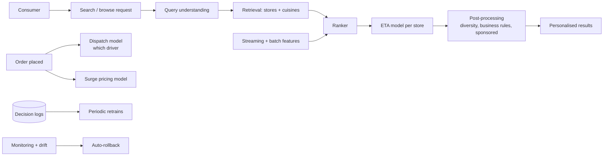

# DoorDash — Search, ranking, and ETA (deep dive)

## Problem

DoorDash is a three-sided marketplace: consumers, restaurants, drivers. ML is in the path of every order: which restaurants to surface, how to rank them, what ETA to promise, which driver to route, what surge multiplier to apply. The 2020-2024 engineering posts describe the platform and its evolution.

## Architecture (composite 2020-2024)

## Three load-bearing decisions

1. **Per-feature freshness SLO with auto-paging.** Each feature in the platform has a defined freshness target; violations page the owning team. This catches the silent failure where a model is "up" but stale features are degrading its output.

2. **Quality SLO + auto-rollback.** A rolling quality metric vs baseline drives automatic rollback on sustained breach. The post (2022) describes specific incidents this prevented.

3. **Multiple models composed at request time.** Search ranking, ETA, surge, and dispatch are separate models that compose: the ranker uses ETA as a feature; surge feeds into both pricing and dispatch. Compositional model architecture is a first-class concern.

## What was hard

- **ETA accuracy.** Wrong ETAs damage trust (early arrivals are wasteful; late arrivals are angry calls). The ETA model has to be calibrated, not just accurate on average.

- **Cross-side effects.** Improvements in the dispatch model affect driver supply; improvements in search affect demand; both feed back into surge. A "local improvement" in one model can degrade global marketplace efficiency.

- **Adversarial behaviour.** Some drivers / restaurants game any visible signal. DoorDash invested in hidden features and detection mechanisms similar to Stripe Radar's playbook.

- **Coverage and fallback.** When a model's feature pipeline degrades, the heuristic fallback must keep the marketplace functional. The coverage SLI catches when fallbacks are happening too much.

## What you should steal

- **Per-feature freshness SLO**. The pattern catches a class of failure that aggregate SLOs miss.
- **Coverage SLI** as a first-class metric. "Is the model actually firing?" matters as much as "is the model server up?"
- **Compositional model architecture** with explicit interfaces. ETA produces a number that ranker consumes; both have own SLOs and own owners.
- **Auto-rollback calibrated against historical incidents**, not against gut feel.

## Sources

- "Maintaining Machine Learning Model Accuracy Through Monitoring" (DoorDash Engineering, 2022).
- "Real-time Predictions at DoorDash" (DoorDash Engineering, 2021-2023).
- "How DoorDash Built Its ML Feature Platform" (DoorDash Engineering, 2022).
- "How DoorDash Models Time-to-Delivery" (DoorDash Engineering, 2020-2023).
- DoorDash Engineering blog, 2020-2024.
