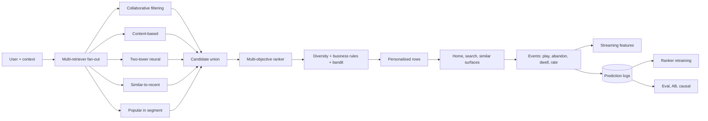

# Netflix — Recommendations stack (deep dive)

## Problem

Netflix's recommendations are the product. Across home, search, similar-titles, push notifications, and trending, recommendations drive what users watch. Getting them wrong costs subscribers; getting them right is the moat. The 2009 Netflix Prize made the team famous for matrix factorisation; the 2010s evolution went much deeper.

## Architecture (composite picture from public engineering posts 2015-2023)

## Three load-bearing decisions

1. **Personalisation at every surface.** Not just the home page; every row, every search result, every push notification is personalised. The recsys is the product surface, not a feature.
2. **Multi-objective ranking.** A single "click probability" optimisation produces clickbait. Netflix's posts describe optimising for completion, watch-time, satisfaction (post-watch ratings), and balance over a session — not just immediate clicks.
3. **Causal experimentation as infrastructure.** Hundreds of A/B tests in flight at any time. Statistical machinery handles overlap and effect estimation. The experimentation platform is itself a major engineering investment.

## What evolved

- **From batch matrix factorisation to deep learning.** The 2009 SVD++ winner is conceptually distant from 2020s neural ranking.
- **From single-objective to multi-objective.** Watch time was an early surrogate; satisfaction layers got added.
- **From homepage-only personalisation to full-surface.** Search, push, similar-titles, episodes-of-the-day — all personalised independently with shared infrastructure.
- **From recommendations to interactive prompts.** "Are you still watching?" is a recommendation prompt with its own model. So is the choice of artwork image shown for a title.

## What you should steal

- **Multi-objective ranking.** Even if you start with one metric, plan for the second and third.
- **A/B testing as infrastructure**, not a side project. Without it you cannot tell whether changes help.
- **Per-surface recommenders sharing infrastructure.** A single platform supports many recsys products. Don't build the same primitives five times.
- The discipline of **causal inference**, not just observational metrics, for high-stakes recsys decisions.

## What's hard to see publicly

The shape of Netflix's stack — multi-retriever, multi-objective ranking, per-surface personalisation — is well documented. The specific architectures of individual models are less public after 2020 (most engineering posts shifted to MLOps and infrastructure topics rather than model details). What's load-bearing isn't the specific ranker architecture; it's the surrounding system.

## Sources

- "Netflix Recommendations: Beyond the 5 Stars" (Netflix Tech Blog, 2012).
- "Artwork Personalization at Netflix" (Netflix Tech Blog, 2017).
- "Recommending What Video to Watch Next" (RecSys 2019; companion Netflix post).
- "Experimentation at Netflix" (Netflix Tech Blog, 2020-2023).
- "Causal Inference at Netflix" (Netflix Tech Blog, 2022).
- "Personalization at Netflix" RecSys keynote talks, 2016-2023.
