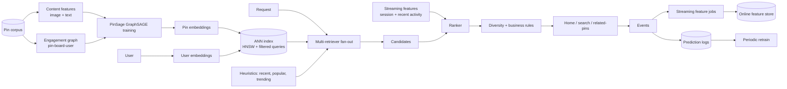

# Pinterest — PinSage and the recsys platform (deep dive)

## Problem

Pinterest's product is fundamentally a recommendation engine. Billions of pins, hundreds of millions of users, dense engagement graph (pin -> board, user -> board, user -> pin). The 2018 PinSage paper (Ying et al., KDD 2018) introduced graph convolutional networks at web scale. The years since have layered streaming features, real-time recommendations, and the platform infrastructure around it.

## Architecture (composite 2018-2023)

## Three load-bearing decisions

1. **Graph aggregation for embeddings.** Each pin's embedding is informed by its neighbours in the engagement graph, not just its own content. Captures multi-hop semantics; gracefully handles cold-start (a new pin inherits signal from its initial board).
2. **Random-walk neighbour sampling.** Full neighbour aggregation at Pinterest's scale is intractable; importance-sampled walks make it tractable.
3. **Multi-layer caching for online serving.** L1 in-replica + L2 edge + L3 online store, with per-feature TTLs. Necessary for hot keys (viral pins, popular boards).

## What had to be rebuilt or added

- **Real-time streaming features.** The 2018 PinSage paper was offline batch; 2022 posts describe Flink-based streaming features for session-context personalisation.
- **Filtered queries.** Pure ANN doesn't handle "show me pins from this category"; Pinterest invested in ANN with native filtering for production needs.
- **Cold-start exploration.** New pins need exposure to generate engagement signal; exploration policy gives them controlled traffic.
- **Compute economics.** PinSage's training is expensive; serving the embeddings is cheap (just an ANN lookup). Pinterest's architecture pushes complex compute to offline / batch where it can amortise.

## What you should steal

- **Graph-based embeddings** when your domain has a meaningful graph structure.
- **Multi-layer caching** as the right default for hot-key access patterns.
- **Streaming features for session context** as the highest-leverage modern addition to a recsys.
- **Random-walk sampling** as a general technique for "I need neighbours but can't afford to enumerate them all."

## What's harder to copy

The graph itself. Pinterest's pin-board-user graph is dense and behaviour-driven. Many products don't have an analogous structure. Trying to force graph methods onto a domain without a real graph rarely pays.

## Sources

- "Graph Convolutional Neural Networks for Web-Scale Recommender Systems (PinSage)," Ying, He, Chen, Eksombatchai, Hamilton, Leskovec (Pinterest / Stanford, KDD 2018).
- "Real-time Machine Learning at Pinterest" (Pinterest Engineering, 2022).
- "Building a Feature Platform at Pinterest" (Pinterest Engineering, 2023).
- "How Pinterest Uses ML for Search and Recommendations" (Pinterest Engineering, 2020-2024).
