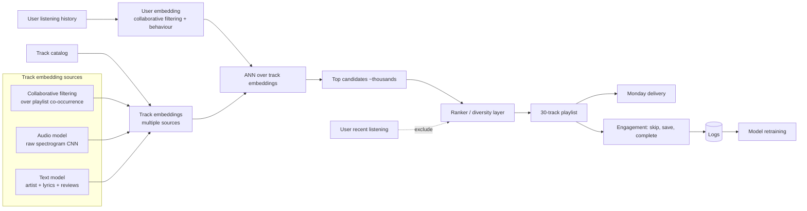

# Spotify — Discover Weekly (deep dive)

## Problem

Discover Weekly is Spotify's signature personalised playlist — 30 tracks every Monday tailored to each user. Launched in 2015. The product question: surface music a user hasn't heard but probably loves, weekly, for hundreds of millions of users. The engineering question: do this at scale, against a corpus of tens of millions of tracks, with diverse user tastes.

## Architecture (composite from public talks 2015-2023)

## Three load-bearing decisions

1. **Multi-source track embeddings.** Collaborative filtering captures "what users put in playlists together"; audio CNN captures sonic similarity; text captures semantic similarity. A track has multiple embeddings; the recommender uses them appropriately.
2. **Weekly cadence, not real-time.** Discover Weekly is a batch product. Monday delivery means the pipeline can take hours, can use the heaviest models, can run rich offline eval. This is a deliberate architectural simplification.
3. **Exclude recently heard tracks.** A discovery product whose results the user already knew is broken. The exclude-list logic is straightforward but load-bearing — a discovery playlist that includes Coldplay for someone who listened to Coldplay this week is a bug.

## What was hard

- **Cold-start tracks.** New uploads have no listening data. Audio CNN-based embeddings let them be surfaced; the audio model is the cold-start bridge.
- **Cold-start users.** A user with three plays of history has no useful user embedding. Discover Weekly didn't exist for very new users initially; later, hybrid content-and-bandit approaches gave them an experience.
- **Diversity vs relevance.** A pure-similarity recommender would produce 30 tracks that all sound alike. Diversity penalisation in the ranker, plus per-genre / per-era caps, prevents this.
- **Cultural specificity.** Music taste varies enormously across regions, languages, and demographics. Region-specific models and signals had to be added.

## What you should steal

- **Multi-source embeddings** when a single source has known weaknesses. Audio + behaviour + text covers more than any one alone.
- **Batch cadence as a deliberate choice** for discovery products. Not every recsys product needs real-time.
- The **exclude-recently-seen** discipline. Discovery is for things the user hasn't seen.
- The acknowledgement that **cold-start needs first-class architecture**, not an afterthought.

## What's still happening

Spotify's 2020-2024 engineering posts have shifted toward bandits (BaRT, see [Module 07 case studies](../07-recommendation-systems/case-studies/spotify-bart-2020.md)) for home-screen surfaces, and toward Voyager (see [Module 05 case studies](../05-vector-dbs-and-retrieval/case-studies/spotify-voyager-2023.md)) for the ANN infrastructure that powers retrieval across recommendations.

## Sources

- "Personalization at Spotify Using Cassandra" (Spotify Engineering, 2015).
- "Recommending Music on Spotify with Deep Learning" (Spotify Engineering, 2014).
- "From Idea to Execution: Spotify's Discover Weekly" (Chris Johnson, MLConf, 2015).
- "BaRT: Bandits for Recommendations as Treatments" (Spotify, RecSys 2020).
- "Algorithmic Effects on the Diversity of Consumption on Spotify," Anderson et al. (Spotify, 2020).
- Spotify Engineering blog, 2014-2024.
