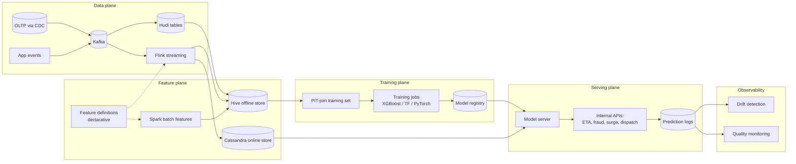

# Uber — Michelangelo (deep dive)

## Problem

By 2015-2016, Uber had separate ML pipelines for ETA, fraud, surge pricing, food-delivery dispatch, marketplace matching, customer support — each built ad-hoc. Onboarding a new use case took months. Common infrastructure didn't exist. Feature definitions diverged across teams. Michelangelo was the platform that consolidated the ML lifecycle for the whole company.

## Architecture (canonical 2017-2019 version, evolved since)

## Three load-bearing decisions

1. **A single feature definition, two execution backends.** A feature is declared once; the compiler produces a Spark job (offline) and a Samza / Flink job (streaming) plus a service-side reader. Same logic, two paths.
2. **Logged-features-as-training-data.** Predictions are logged with the features that were used at inference. Training sets are built from logs, not from re-running the feature pipeline against the warehouse. This is the durable defence against train-serve skew.
3. **Centralised platform team owning the abstraction.** Twenty engineers on Michelangelo saved hundreds across the company by not rebuilding the same primitives.

## What had to be rebuilt

- **Streaming engine.** Samza in 2017; migrated to Flink as the streaming ecosystem matured. The lesson: the streaming engine is the hardest piece to swap; pick carefully.
- **Online store.** Cassandra ran into hot-key issues at consumer scale; layered caching and per-key sharding had to be added.
- **From batch + stream to streaming-first.** The 2017 architecture treated batch and streaming as parallel paths joined at the store. The 2021-2023 evolution (described in "Real-time Data Infrastructure at Uber," VLDB 2021) collapsed both into streaming-first with batch as a sink.
- **Multi-cloud and multi-region.** What started as a single-region system evolved through several major rewrites to support geographic isolation.

## What you should steal

- **Logged-features-as-training-data** as platform policy, not guideline.
- **One feature definition, two backends** as the durable answer to skew.
- **A central platform team** that owns the abstraction. Distributed feature engineering across teams without a platform produces a swamp.
- **Streaming-first** as the long-term destination, even if the first version is batch + stream.

## Why this case study is the canonical one

Michelangelo's structural decisions are reflected in every subsequent ML platform — Tecton commercially, Feast in open source, Stripe internally, Pinterest, DoorDash, LinkedIn, Wayfair, Robinhood. The 2017 paper is the most-influential ML-platform engineering post of the last decade.

## Sources

- "Meet Michelangelo: Uber's Machine Learning Platform" (Uber Engineering, 2017).
- "Scaling Machine Learning at Uber with Michelangelo" (Uber Engineering, 2019).
- "Real-time Data Infrastructure at Uber," Mishra et al. (VLDB 2021).
- Uber Engineering Blog, ML platform archive 2017-2024.
