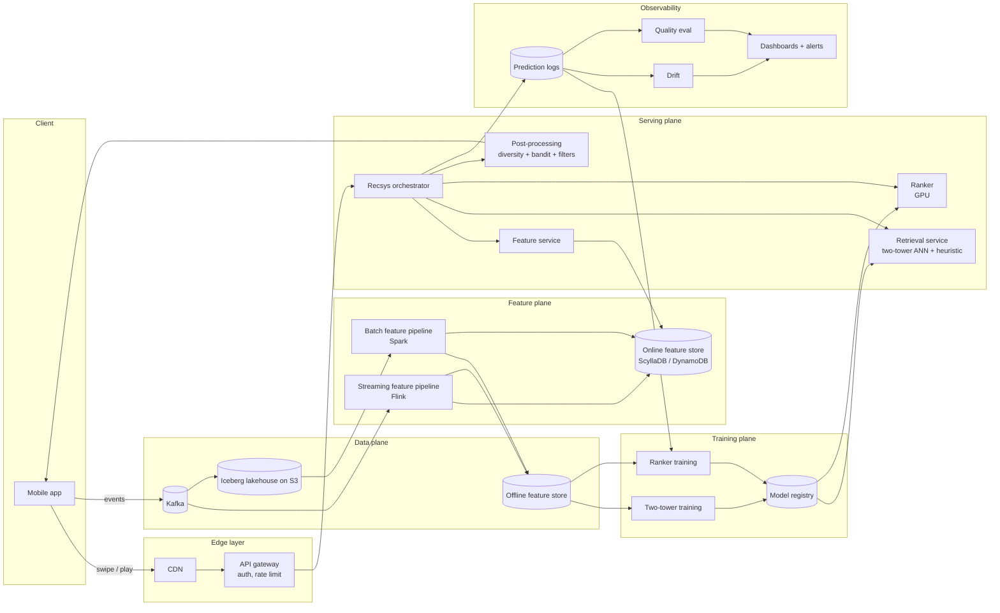
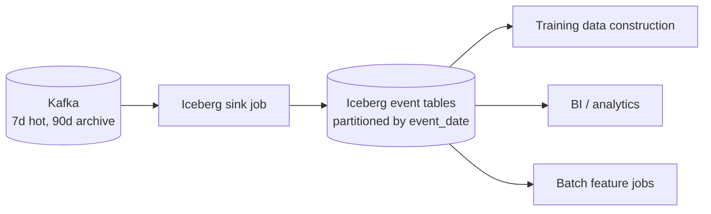
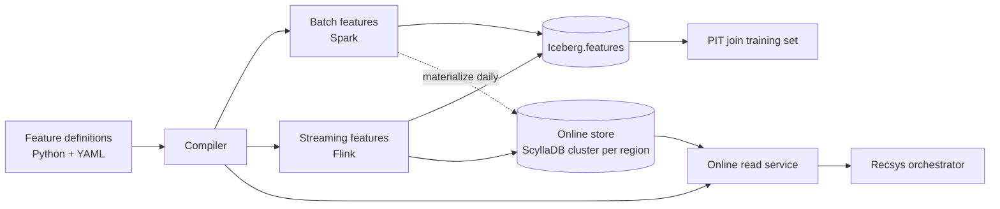
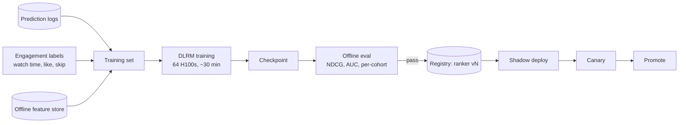
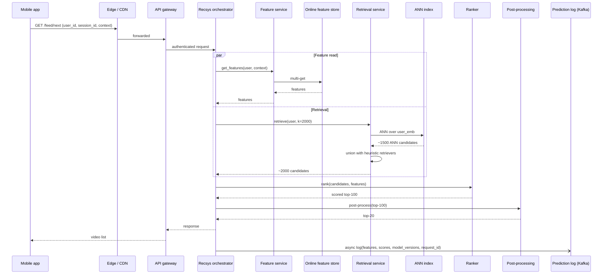
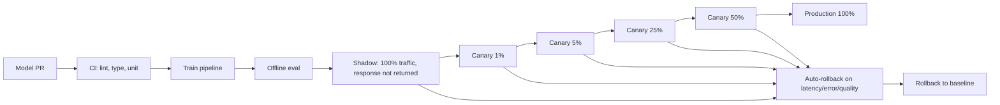
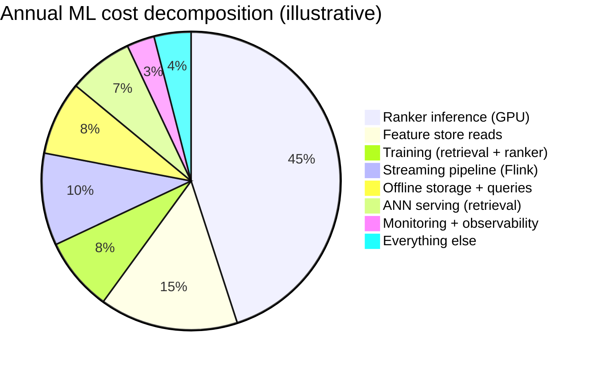

# 15 — Capstone: Personalised Video Recommendations at 100M DAU

> Design document for a personalised video recommendation system at 100 million daily active users. Written as a real artefact you could put in front of a tech-lead-review or an interview panel. Approximately 8,500 words.

**Status.** Design proposal. **Owner.** Author of this course. **Last updated.** 2026-05-18.

---

## 1. Problem and scale

### 1.1 Product

Personalised video recommendations for a short-form video platform. Each user opens the app and sees a vertically-swipable feed of videos. Tapping plays; swiping skips. The system must serve the next video before the user finishes the current one. The product metrics that matter are watch time, satisfaction signals (likes, saves, follows), and retention.

### 1.2 Scale

| Quantity | Value |
|----------|-------|
| Daily active users | 100,000,000 |
| Sessions per user per day (mean) | 6 |
| Videos viewed per session (mean) | 30 |
| Total video impressions per day | ~18 billion |
| Total catalog size | ~1 billion videos |
| New videos uploaded per day | ~3 million |
| Mean QPS (recommendation requests) | ~25,000 |
| Peak QPS | ~80,000 (3-5x mean, evenings) |
| Geographic distribution | Multi-region (US, EU, LATAM, APAC, MENA) |

A useful framing: every 24 hours, the system makes ~18 billion ranking decisions over a candidate pool of up to ~1 billion items. The math forces a two-stage retrieval-then-ranking architecture; no model can score a billion items per request.

### 1.3 What is in scope

- The recommendation API: given a user and a session context, return the next K videos.
- The data pipeline that feeds it: event ingestion, feature engineering, training data construction.
- The training pipelines: retrieval (two-tower) and ranker.
- Online serving: feature store, retrieval, ranker, post-processing.
- Monitoring, drift detection, rollout / rollback machinery.
- Cost model and capacity planning.

### 1.4 What is out of scope

- Video transcoding, CDN, playback (existing platform components, assumed available).
- Trust and safety classifiers (assumed to exist as a separate pipeline producing per-video safety labels).
- Discovery products beyond the main feed (search, similar-videos, creator profiles — could reuse this infrastructure but not designed here).
- Monetisation (ad insertion is a separate ranker downstream, not in this design).

### 1.5 Non-goals worth naming

- **Sub-100 ms p99 latency.** Not necessary. Users are watching the current video while the next one is fetched; the budget is "fetched before the current video ends," which is seconds, not tens of milliseconds.
- **Real-time training.** Frequent batch (every 30-60 minutes) for the ranker is sufficient given the streaming features compensating for staleness.
- **Single global model.** Per-region models are explicitly OK and probably necessary.

---

## 2. SLOs

The five SLOs that govern operation. Each has an owner and an error-budget policy.

| SLO | Target | Window | Owner | Action on breach |
|-----|--------|--------|-------|------------------|
| **Latency p99** | <= 200 ms p99 for the recommendation API | 28 days, per region | Serving team | Page; freeze model deploys until resolved |
| **Availability** | >= 99.95% successful requests | 28 days | Serving team | Page; standard SRE response |
| **Feature freshness** | p95 of streaming feature age <= 30 s | 7 days | Feature platform team | Page on sustained breach (>30 min) |
| **Quality (engagement)** | Rolling 7-day session watch-time delta vs trailing 28-day baseline >= -1% | 7 days | Modeling team | Auto-rollback to prior ranker if breached for 24h |
| **Coverage** | >= 99% of requests scored by the ranker (vs heuristic fallback) | 28 days | Feature platform team | Page on sustained breach (<99% for >30 min) |

Three observations on these SLOs:

1. **Latency is 200 ms p99, not 50.** The next-video request runs while the current video plays; the budget is generous. Tighter than 200 ms is over-engineering.
2. **Quality SLO uses watch time, not clicks.** Tap-to-play in this product is essentially every video; engagement is "did they watch more than a few seconds and continue swiping."
3. **Coverage SLI is explicitly listed** because the silent failure mode (model degrades to fallback) is the costliest.

### 2.1 Error-budget policy

- Latency or availability breach: freeze new model releases until resolved.
- Quality SLO breach for 24 h: auto-rollback to the previous ranker. Modeling team gets a postmortem-required tag.
- Coverage SLO breach: feature platform team incident; if persistent, freeze feature changes until resolved.

---

## 3. High-level architecture



Three architectural commitments:

1. **Streaming-first feature pipeline.** Streaming is the canonical compute; batch and online are derived sinks. Convergent with Uber, Stripe, Pinterest, Tecton.
2. **Logged-features-as-training-data.** Predictions are logged with the features used; training sets are built from logs. The durable defence against train-serve skew.
3. **Per-region serving with global training.** Models trained globally (or per-region where data justifies it); serving stack independent per region; control plane reconciles model versions.

---

## 4. Data architecture

### 4.1 Event ingestion

Every user interaction emits an event. The taxonomy:

| Event | Producer | Volume / day |
|-------|----------|---------------|
| `impression` (video shown) | client | ~18B |
| `play_start` | client | ~12B (subset of impressions) |
| `play_progress` (every 5s) | client | ~50B |
| `play_complete` | client | ~5B |
| `skip` | client | ~13B |
| `like / save / follow` | client | ~2B |
| `share` | client | ~200M |
| `report` | client | ~1M |
| `comment` | client | ~500M |

All events flow into Kafka. Per-topic partitioning by `user_id` to preserve per-user ordering. Retention: 7 days hot, 90 days archived to S3.

Volume: ~100 billion events/day total, ~10-50 TB compressed daily.

### 4.2 Storage



**Iceberg lakehouse on S3.**

- Tables partitioned by `event_date`; clustered by `user_id` for user-keyed reads.
- Statistics enabled per column; predicate pushdown shaves 90%+ of scans for filtered queries.
- Compaction job nightly; weekly full snapshot replication for DR.
- Catalog: AWS Glue or open-source Polaris.

Why Iceberg specifically (vs Delta or Hudi):
- Engine neutrality: Spark, Trino, Flink, DuckDB all read.
- Mature ecosystem in 2026; most cloud vendors support it natively.
- Schema evolution is well-tested.

### 4.3 Lineage and quality

- **OpenLineage** events emitted from every Spark / Flink job; **DataHub** catalogs lineage.
- **Data contracts** on producer schemas (Buf / Protobuf with Schema Registry). CI breaks on incompatible schema changes.
- **Great Expectations** assertions on every Iceberg write: row counts within bounds, no nulls in required columns, value distributions within reasonable ranges.
- **Monthly audit** of unused features / tables; deprecate aggressively.

### 4.4 Why this is enough (and what we explicitly skip)

We skip:
- Real-time CDC from an OLTP database (we don't have a big transactional DB).
- Late-data handling beyond watermarks (events older than the watermark go to a side output for offline replay, not for serving).
- Multi-cloud lakehouse replication (one cloud for now; DR via cross-region S3 replication).

---

## 5. Feature architecture

### 5.1 Feature inventory

About 300-500 production features at steady state, grouped:

| Group | Examples | Source | Refresh |
|-------|----------|--------|---------|
| **User long-term** | `user_lifetime_videos_watched`, `user_top_categories_30d` | Batch over Iceberg | Daily |
| **User session** | `videos_watched_this_session`, `categories_seen_this_session` | Flink streaming | Seconds |
| **User affinity** | `user_creator_affinity`, `user_genre_affinity` | Spark | Daily; faster for hot users |
| **Video metadata** | `video_duration`, `video_creator_id`, `video_creation_ts` | At upload | On change |
| **Video trending** | `video_view_velocity_1h`, `video_skip_rate_1h` | Flink streaming | Seconds |
| **Video embedding** | dense vector from content + behaviour model | Periodic batch | Daily; faster for new videos |
| **Pair / interaction** | `user_creator_recent_clicks`, `user_video_history_position` | Streaming + batch | Mixed |
| **Context** | `time_of_day`, `device_class`, `country`, `network_quality` | Request-time | Live |

### 5.2 Feature store design



- **Tooling:** Feast for the registry + custom code for the streaming-feature compiler; or commit to Tecton if ops budget allows. Choice: Feast self-hosted for cost control.
- **Online store:** ScyllaDB (Cassandra-compatible) for per-region single-digit-ms multi-get. Sized per region: ~2 TB per region across ~15-30 nodes.
- **Offline store:** Iceberg tables, partitioned by `feature_set` and `event_date`.

### 5.3 Point-in-time correctness

Every training set is constructed with PIT joins. Each labelled row `(user, video, ts, label)` queries the offline store for feature values *as of `ts - epsilon`*, where epsilon is set to the typical online serving staleness (~10 s for streaming features).

The training set construction is itself a Spark job, parametrised by the training window. Runs daily; outputs a snapshot tagged with input data version + feature definitions version.

### 5.4 Hot-key handling

Top videos get 1000x the QPS of median. Per-replica in-memory cache (60 s TTL) for the top 10k videos absorbs >90% of feature reads for hot videos; the online store sees the tail.

### 5.5 Logged-features-as-training-data

Critical commitment. Every prediction logs the exact features used at serving time. Training sets are built from these logs joined to outcome labels (`play_complete`, `skip`, `like`, etc.) by `request_id`. The serving feature path is the source of truth for training.

This eliminates the train-serve skew failure mode that has historically been the dominant production bug across Uber, Stripe, Pinterest, Etsy, DoorDash.

---

## 6. Training architecture

### 6.1 Two models, two pipelines

| Model | Purpose | Architecture | Retrain cadence |
|-------|---------|--------------|------------------|
| **Two-tower retrieval** | User embedding + video embedding for ANN retrieval | MLP-based, ~10-50M params each tower | Daily |
| **Ranker** | Multi-objective scoring of candidates | DLRM-style with embedding tables + dense layers, ~200M params | 60 min |

### 6.2 Two-tower retrieval training

```mermaid
flowchart LR
    LOG[(Prediction logs)] --> POS[Positive pairs<br/>play_complete + like]
    LOG --> NEG[Negative pairs<br/>impressed but not watched]
    POS --> SAMPLE[In-batch sampling + hard negatives]
    NEG --> SAMPLE
    SAMPLE --> TRAIN[Two-tower training<br/>softmax loss with log-q correction]
    TRAIN --> EMB[User + video embeddings]
    EMB --> EVAL[Recall@1000 on held-out]
    EVAL -- pass --> REG[(Registry: two-tower vN)]
```

- **Hardware:** 8 x H100 single node. ~6 hours for a daily training run.
- **Loss:** sampled softmax with log-q correction (Yi et al., Google, RecSys 2019).
- **Hard negatives:** sampled from "candidates retrieved but not selected" in production logs. ~30% of negatives are hard.
- **Eval:** recall@1000 on a temporal-holdout set. Target >= 80%; alert at <75%.

Video embeddings refreshed daily; the resulting ANN index is rebuilt nightly.

### 6.3 Ranker training



- **Architecture:** DLRM-style with embedding tables for high-cardinality features (user ids, video ids, creator ids, hashtags) + dense layers for behavioural features. ~200M parameters total; embedding tables dominate memory.
- **Hardware:** 64 H100s, FSDP for embedding sharding. Each training run ~30 minutes wall time.
- **Cadence:** every 60 minutes. New training set = trailing 7 days of logs.
- **Loss:** multi-task — joint prediction of `play_complete_probability`, `like_probability`, `expected_watch_seconds`. Combined into a single scalar by a learned linear stack.

The multi-objective formulation is the most important design choice in the ranker. A pure "click probability" optimisation produces clickbait. Multi-objective penalises high-skip but high-tap-rate videos.

### 6.4 Training infrastructure

| Component | Choice |
|-----------|--------|
| Cluster | Kubernetes + Kueue for gang scheduling |
| GPU type | H100 for retrieval and ranker training; H200 if available for embedding-table-heavy models |
| Spot usage | Yes for training; async sharded checkpoints every 10% of compute |
| Experiment tracking | MLflow self-hosted |
| Pipeline orchestrator | Dagster |
| Storage for artefacts | S3 with object hashing |

### 6.5 Eval discipline

- **Offline:** NDCG@10, AUC on watch-time prediction, per-cohort breakdown, calibration plot.
- **Slices monitored:** cold users (< 5 sessions), power users (top decile), new videos (< 24 h), long-tail videos (< 100 views), per-region.
- **Holdout discipline:** time-based train/eval split; final eval slice not used in hyperparameter tuning.
- **Quality gate for promotion:** within 1% relative NDCG of baseline OR strictly better; no per-cohort regression > 2%.

---

## 7. Serving architecture

### 7.1 Request flow



### 7.2 Latency budget

```text
Network (client to edge, RTT):                30 ms
TLS / auth / rate limit:                       5 ms
Recsys orchestrator overhead:                  5 ms

Parallel branch A (feature read):             15 ms p99
Parallel branch B (retrieval):                25 ms p99
  - Two-tower user-tower inference:           ~5 ms
  - ANN call:                                ~15 ms
  - Heuristic retrievers (parallel):         ~10 ms
  - Union + dedup:                            ~3 ms

[Parallel branches collapse to max = 25 ms]

Ranker (top-2000 -> top-100):                 70 ms p99
  - Feature hydration for candidates:         15 ms
  - DLRM forward pass on GPU, batch=2000:     45 ms
  - Sort + slice:                              5 ms
  - Network within service mesh:               5 ms

Post-processing (diversity + bandit + filters): 15 ms p99
Response build + encode:                       5 ms
Network out (edge to client):                 30 ms
----
Total:                                       ~200 ms p99 (within SLO)
```

See [`../calculators/latency-budget.ipynb`](../calculators/latency-budget.ipynb) for the parametric version.

Three optimisations baked into the budget:

1. **Feature read and retrieval in parallel.** Both depend only on `user_id` + context; no reason for serial.
2. **Feature hydration for candidates after retrieval, not before.** We need features only for the ~2000 retrieved candidates, not for all 1 billion videos.
3. **GPU batching for the ranker.** A batch of 2000 candidates per request becomes a batch of 64,000 across 32 concurrent requests; that's saturating a GPU.

### 7.3 Retrieval

Multiple retrievers in parallel; their unions form the candidate set. Each retriever optimises for a different intent.

| Retriever | What it returns | Latency | Why |
|-----------|------------------|---------|-----|
| **Two-tower ANN** | Top 1500 by similarity to user embedding | 15 ms | Long-term taste |
| **Similar-to-recent** | Videos similar to user's last 5 watched | 5 ms (cached) | Session-level signal |
| **Trending in geo** | Top 200 trending videos in user's country / language | 2 ms | Hot content |
| **Cold-start exploration** | 50 new videos meeting content-quality threshold | 5 ms | Closes the feedback loop for new content |
| **Editorial / curated** | Per-region curated list (if any) | 1 ms | Business / safety |

Total candidates after union + dedup: ~2000. Each candidate carries a "retrieval source" tag — useful for downstream diagnostics ("which retriever surfaced this?") and for cold-start fairness analysis.

### 7.4 Ranker

The ranker scores all ~2000 candidates with the multi-task DLRM. Score = learned linear combination of per-task heads.

```text
final_score = α * p(play_complete) +
              β * E[watch_seconds] / video_duration +
              γ * p(like) +
              δ * p(skip)  (with negative coefficient)
```

The coefficients α, β, γ, δ are tuned offline against the target business metric (session-level watch time).

Inference: TensorRT-optimised ONNX export running on Triton. Dynamic batching with a 5 ms wait window. Each replica sustains ~500 inference batches/sec (each batch = 2000 candidates from one request). With 80k peak QPS across regions and ~5 regions, each region needs ~16k QPS peak / 500 = ~32 ranker replicas + 30% headroom + hot spare = ~45 replicas per region. Approximately 250 H100 / L40S equivalents across the global fleet (or fewer, larger A100 / H100 if economics favour them).

### 7.5 Post-processing

```text
1. Apply hard filters: muted creators, blocked content, reported videos, age-inappropriate.
2. Apply diversity:
   - At most 2 videos per creator in the top 20.
   - At most 4 videos per category.
   - MMR with relevance vs similarity-to-already-picked.
3. Apply bandit exploration: 3 of 20 slots reserved for exploration, selected by Thompson sampling over candidate sources.
4. Apply sponsored content slot (if applicable): typically 1 of 20.
5. Sort, return top 20.
```

### 7.6 Rollout machinery



Each stage runs for 24-48 hours. Auto-rollback criteria documented per stage; tightest at 50% (where statistical power is highest).

---

## 8. Monitoring and drift plan

### 8.1 Prediction log schema

Every served recommendation produces a log entry:

```json
{
  "request_id": "uuid",
  "user_id": "hashed",
  "session_id": "session-token",
  "timestamp_ms": 1715990400000,
  "region": "us-east-1",
  "model_versions": {
    "two_tower": "v123",
    "ranker": "v456",
    "feature_set": "v89"
  },
  "candidates_returned": [
    {
      "video_id": "hashed",
      "retrieval_source": "two_tower" | "similar_recent" | "trending" | "cold_start" | "editorial",
      "ranker_score": 0.87,
      "post_processing_flags": ["mmr_kept", "exploration_slot"],
      "final_position": 3
    }
  ],
  "features_used_hash": "sha256-of-feature-bundle",
  "features_used_compressed": "<5KB compressed protobuf>",
  "latency_ms_per_stage": {
    "feature_read": 12,
    "retrieval": 22,
    "rank": 65,
    "post": 8,
    "total": 145
  }
}
```

Retention: 90 days hot, 13 months archived. Daily aggregations into materialised views for fast query.

### 8.2 Metric hierarchy

```mermaid
flowchart TD
    L0[Tier 0: customer-visible]
    L0 --> CR[Click-through equivalents]
    L0 --> WT[Watch time per session]
    L0 --> RET_M[D7 retention]

    L1[Tier 1: system health]
    L1 --> LAT[Latency p50/95/99]
    L1 --> AV[Availability]
    L1 --> ERR[Error rate]
    L1 --> COV[Coverage]

    L2[Tier 2: model health]
    L2 --> NDCG[NDCG@10]
    L2 --> CALIB[Calibration]
    L2 --> SLICE[Per-cohort metric]

    L3[Tier 3: data health]
    L3 --> FRESH[Feature freshness per feature]
    L3 --> DRIFT[Per-feature drift KS / PSI]
    L3 --> SCHEMA[Schema conformity]

    L0 -. drives .-> AUTORB[Auto-rollback]
    L1 -. pages .-> AUTORB
    L2 -. pages .-> AUTORB
    L3 -. notifies .-> DASH[Dashboard]
```

Tier 0 is the product. Tier 1 is operations. Tier 2 is the model. Tier 3 is the data.

Paging policy:

- **Page (24/7):** Tier 1 SLO breach, Tier 0 quality SLO sustained breach.
- **Notify (business hours):** Tier 2 quality dip, Tier 3 drift signals.
- **Dashboard only:** per-cohort and per-region trends.

### 8.3 Drift detection

- **Per-feature KS and PSI** on rolling 24-hour windows vs trailing 7-day baseline. Threshold KS > 0.15 = notify; > 0.25 = page.
- **Prediction distribution KS** between current model and production baseline.
- **Calibration plot** per cohort, refreshed daily.

### 8.4 Slice metrics

Specific cohorts tracked separately:

- Cold users (< 5 sessions lifetime).
- Power users (top decile by daily sessions).
- New videos (< 24 h since upload).
- Long-tail videos (< 100 lifetime views).
- Each region.
- Each major language.

A regression on aggregate is escalated; a regression on any of these slices is also escalated, even if aggregate looks OK.

---

## 9. Cost model

Numbers below are 2026 illustrative; recompute against current pricing before any decision.

### 9.1 Annual cost decomposition



### 9.2 Numeric estimates

| Bucket | Daily cost | Monthly cost | Notes |
|--------|-----------|---------------|-------|
| Ranker inference | $30,000 | $900k | ~250 H100/L40S equivalents at $3-4/hr globally |
| Feature reads | $8,000 | $240k | ScyllaDB across 5 regions |
| Streaming pipeline | $5,000 | $150k | Flink on K8s, ~200 vCPU |
| Training (continuous ranker + daily retrieval) | $4,500 | $135k | Average ~4-8 H100 hours per train, 24 trains/day |
| Offline storage + queries | $5,000 | $150k | S3 + Iceberg + Spark queries |
| ANN serving | $4,000 | $120k | Vector index across regions |
| Monitoring | $2,000 | $60k | Logging, dashboards, metric store |
| Everything else | $2,500 | $75k | Misc |
| **Total** | **~$61k/day** | **~$1.83M/month** | **~$22M/year** |

Per-request cost: $61,000 / 18B impressions ≈ $0.0000034 per impression, or $0.000068 per ranking request (one ranking serves 20 impressions). Per-user cost per day: $0.00061.

See [`../calculators/recsys-cost.ipynb`](../calculators/recsys-cost.ipynb) for the parametric version.

### 9.3 Cost optimisation roadmap

Year 1 priorities (in expected impact order):

1. **INT8 quantization of ranker.** ~1.5-2x throughput; expected saving ~$200-400k/year.
2. **Session-scoped feature caching.** ~30% reduction in feature reads; saving ~$70k/year.
3. **Smaller ranker for cold sessions.** Heuristic / cheap ranker for the first impression of a session; full ranker after. Saving ~$100-150k/year.
4. **Spot training.** Already in place; 50-70% saving on training already realised.

Year 2 candidates:

5. **Knowledge-distilled ranker.** A smaller distilled model trained from the production ranker. ~40% cost reduction if quality holds; large investment.
6. **Custom silicon partner pricing.** AWS Trainium / Inferentia2, Google TPU, or partner GPU clouds. Often 30-40% cheaper.

---

## 10. Failure modes and rollback

### 10.1 Failure mode catalog

| # | Failure | Detection | Mitigation | Recovery |
|---|---------|-----------|------------|----------|
| 1 | **Ranker latency spike** | p99 SLO breach | Auto-rollback to prior model | Investigate; retrain if needed |
| 2 | **Quality regression (post-deploy)** | Watch-time SLO breach | Auto-rollback | Root-cause; gate hardened |
| 3 | **Feature pipeline outage** | Feature freshness SLO breach + coverage SLI drop | Fallback to heuristic; surface trending content | Restart Flink job; replay from Kafka |
| 4 | **Online feature store partial outage** | KV-store latency spike | Per-feature fallback values; degraded mode banner | Repair; replay any stale features |
| 5 | **ANN index corruption** | Retrieval recall drops; cold-start fraction spikes | Fall back to heuristic retrievers + popularity | Rebuild index from offline embeddings |
| 6 | **Model registry unreachable** | Model server can't reload | Continue with currently loaded model | Restore registry; re-promote |
| 7 | **Training data corruption** | Training fails or eval regresses sharply | Block promotion; investigate | Roll forward training pipeline; rerun |
| 8 | **Region-wide outage** | Region availability SLO | Route traffic to neighboring regions | Standard SRE recovery |
| 9 | **Adversarial content spike** | Trust-and-safety pipeline alerts | Up-weight safety filters; possibly emergency curated mode | Investigate; retrain with new label data |
| 10 | **PII leak in logged features** | Compliance scan | Halt logging; redact retroactively | Postmortem; regulator notification if material |

### 10.2 Rollback procedures

Three rollback levels, by time-to-restore:

| Level | What rolls back | TTR |
|-------|-----------------|-----|
| **Soft** | Model version (registry tag flip) | <1 minute |
| **Medium** | Service binary (container redeploy) | 5-15 minutes |
| **Hard** | Full service rebuild from last known good | 30-90 minutes |

Most issues handled at soft level. Medium for service bugs not in the model itself. Hard reserved for catastrophic failures (data corruption, security incident).

### 10.3 Disaster recovery

- **Cross-region replication** of model artefacts and feature definitions.
- **Daily backup** of training data snapshots (Iceberg snapshots already give point-in-time; explicit backup adds geographic redundancy).
- **Game-day** quarterly: simulate region loss, model corruption, feature pipeline crash.

---

## 11. Open questions and what I'd build differently with three more months

### 11.1 Known unknowns

1. **Does the multi-task ranker actually beat single-task on session watch time?** I've assumed it does (consistent with public posts from YouTube, Meta), but for our specific product the joint optimisation may not pay back the complexity. Need to A/B.

2. **What's the right cadence for ranker retraining?** I've spec'd 60 minutes; could be 15 or 240. Trade-off: more frequent = fresher signal but more overhead and more rollback opportunities. The right cadence is empirical.

3. **How much exploration is enough?** 3 of 20 slots is a guess. Insufficient exploration starves new content; too much hurts short-term engagement. Bandit-based slot allocation is the principled answer; calibrating it takes a quarter.

4. **Per-region model or global?** I've spec'd a global model with region as a feature. A per-region model could improve quality at the cost of training pipeline duplication. Worth measuring.

5. **Cold-start: how long until a new user has a useful personalised model?** I've spec'd content-based heuristic + bandit exploration for the first few sessions, but the transition point to the full personalised model needs tuning.

### 11.2 What I'd build differently with three more months

- **A proper experiment platform** before any other lift. Right now this design assumes A/B tests work; in practice that's a system to build. Six weeks dedicated to experiment design + analysis + power calculation tooling. Pays back 10x.

- **Better cold-start architecture for items.** PinSage-style graph aggregation over the (user, creator, video) graph. Three months wouldn't fully get there, but the foundation could be laid.

- **Multi-armed bandit at the row level**, not just the slot level. Each candidate's exploration uncertainty propagates into its score; less hand-tuning.

- **On-device pre-ranking** for the next-3-videos prefetch. Client model picks 3 of 20 server-returned candidates based on within-session signals. Reduces perceived latency dramatically; opens privacy benefits.

- **Causal inference baseline.** Replace observational metric tracking with explicit causal estimates (IPS, doubly-robust). Catches biases the current pipeline can't.

### 11.3 Risks not fully mitigated

| Risk | Why it matters | What's not done |
|------|----------------|------------------|
| Adversarial creator behaviour | Creators game any visible signal; engagement-metric inflation | No formal adversarial training; relies on T&S pipeline catching it |
| Filter-bubble / polarisation | Users get narrower content over time; long-term retention may suffer | Diversity penalty exists; not deeply tuned against long-term engagement signal |
| Compliance regression in new region | New region with different rules (e.g., India age-rating); platform may be slow to adapt | Per-region overrides exist; legal review process not designed here |
| Feature catalog sprawl | 300 features today; 1000 in two years | Quarterly audit policy spec'd; enforcement unclear |
| Knowledge loss | Designer leaves; the system becomes opaque | Architecture decision records and model cards required; quality varies |

---

## 12. References

### Course modules consulted

- [00 Foundations](../00-foundations/README.md)
- [01 Data Platform](../01-data-platform/README.md)
- [02 Feature Stores](../02-feature-stores/README.md)
- [03 Training Infra](../03-training-infra/README.md)
- [04 Serving](../04-serving-online-batch-streaming/README.md)
- [05 Vector DBs and Retrieval](../05-vector-dbs-and-retrieval/README.md)
- [06 LLM Serving and RAG](../06-llm-serving-and-rag/README.md) (limited use; this is not an LLM system but the eval discipline transfers)
- [07 Recommendation Systems](../07-recommendation-systems/README.md)
- [08 Search and Ranking](../08-search-and-ranking/README.md)
- [09 Real-time ML](../09-real-time-ml/README.md)
- [10 Monitoring and Drift](../10-monitoring-and-drift/README.md)
- [11 MLOps and CI/CD](../11-mlops-and-ci-cd/README.md)
- [12 Cost, Multi-tenancy, Scaling](../12-cost-multitenancy-scaling/README.md)
- [13 Privacy, Fairness, Ethics](../13-privacy-fairness-ethics/README.md)
- [14 Case Studies](../14-case-studies-deep-dives/README.md)
- Shared diagrams: [`recsys-two-stage.md`](../diagrams-shared/recsys-two-stage.md), [`online-ml-reference-architecture.md`](../diagrams-shared/online-ml-reference-architecture.md)
- Calculators: [`../calculators/latency-budget.ipynb`](../calculators/latency-budget.ipynb), [`../calculators/recsys-cost.ipynb`](../calculators/recsys-cost.ipynb)

### Primary external sources

- "Deep Neural Networks for YouTube Recommendations," Covington, Adams, Sargin (Google, RecSys 2016).
- "Recommending What Video to Watch Next: A Multitask Ranking System," Zhao et al. (Google, RecSys 2019).
- "Sampling-Bias-Corrected Neural Modeling for Large Corpus Item Recommendations," Yi et al. (Google, RecSys 2019).
- "Graph Convolutional Neural Networks for Web-Scale Recommender Systems," Ying et al. (Pinterest, KDD 2018).
- "Deep Learning Recommendation Model (DLRM) for Personalization and Recommendation Systems," Naumov et al. (Meta, 2019).
- "Meet Michelangelo: Uber's Machine Learning Platform" (Uber Engineering, 2017) and follow-ups.
- "Real-time Data Infrastructure at Uber," Mishra et al. (VLDB 2021).
- "Real-time Machine Learning at Pinterest" (Pinterest Engineering, 2022).
- "Scaling Machine Learning at Stripe" (Stripe Engineering, 2023).
- "Instagram's Explore Recommender System" (Meta Engineering, 2023).
- "Maintaining Machine Learning Model Accuracy Through Monitoring" (DoorDash Engineering, 2022).
- "BaRT: Bandits for Recommendations as Treatments," McInerney et al. (Spotify, RecSys 2020).
- "Apache Iceberg: An Architectural Look Under the Covers" (Tabular / Apache, 2022).
- *Designing Data-Intensive Applications*, Kleppmann (O'Reilly, 2017).
- *Designing Machine Learning Systems*, Huyen (O'Reilly, 2022).
- *Site Reliability Engineering*, Beyer et al. (Google, O'Reilly, 2016).

---

## Appendix A — A note on what this design is not

This is a credible design that an engineering org could build, not the design any specific company runs. Real production systems at this scale have idiosyncrasies — vendor relationships, legacy components, regulatory constraints, specific cost structures, team capabilities — that move concrete choices. The skeleton is right; the muscles depend on the body.

What I most want a reviewer to push back on:

- The latency budget is generous for the product shape; could we do better with on-device pre-ranking?
- The cost line for ranker inference is the largest single number; is there a fundamentally cheaper architecture (sparse ranker, distilled model)?
- The eval discipline is described but not deeply specified; the experiment platform is its own design doc.

The hard parts of running this system in practice — adversarial creator behaviour, filter-bubble effects, compliance in new regions, multi-region failover during incidents — are mentioned in section 11 but not engineered against here. Each is its own follow-up.

Done.
