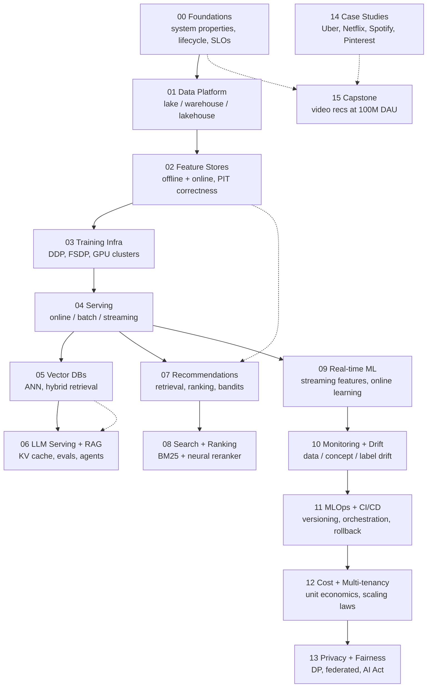

# ML / AI Systems Design

A production-architect course in designing machine learning and AI systems. Beginner to staff-engineer level. Written in the spirit of *Designing Data-Intensive Applications* (Kleppmann 2017) and *Designing Machine Learning Systems* (Huyen 2022) — simple language, diagrams for every architecture, real case studies, trade-off tables you can actually use.

**Audience flavor.** Production architect. You are designing real systems, not skimming papers and not optimising for interview rubrics. Trade-offs, ops, cost, and failure modes are foregrounded.

**Depth.** Deep dive. Roughly six to eight weeks of evening reading.

**Version note.** Current as of 2026-05-18. This field moves fast — every architectural claim is dated. If a claim is more than two years old, the underlying system has probably been rewritten at least once. Use this course as a map of the terrain, not a snapshot of any one vendor's stack.

**House rules.**

- No invented statistics. Every quantitative claim cites a source with a year.
- No emojis. Tables and diagrams over prose.
- No source code in the lessons. Pseudocode in fenced blocks is fine; runnable code lives only in `calculators/`.
- Mermaid for every architecture diagram (renders on GitHub).
- Cross-links to the [glossary](./glossary.md) for jargon.

---

## Roadmap



Solid arrows are the recommended reading order. Dotted arrows mark "you'll want to have read this before tackling the target module."

---

## Module table

| #  | Module | What you'll be able to do at the end | Approx. read |
|----|--------|---------------------------------------|--------------|
| 00 | [Foundations](./00-foundations/README.md) | Reason about the five system properties, draw the ML lifecycle, distinguish train-serve skew from data drift, write an SLO for an ML system. | 60 min |
| 01 | [Data Platform](./01-data-platform/README.md) | Choose between lake, warehouse, and lakehouse; pick a storage format; lay out an ingestion pipeline; cost a query. | 90 min |
| 02 | [Feature Stores](./02-feature-stores/README.md) | Design the two-store pattern, enforce point-in-time correctness, decide build vs buy, defuse the hot-key problem. | 90 min |
| 03 | [Training Infra](./03-training-infra/README.md) | Pick a parallelism strategy by model size, cost a training run, design a fault-tolerant cluster, debug a stalled GPU. | 90 min |
| 04 | [Serving](./04-serving-online-batch-streaming/README.md) | Spec online / batch / streaming inference, build a latency budget, choose a runtime, design canary and shadow rollouts. | 90 min |
| 05 | [Vector DBs and Retrieval](./05-vector-dbs-and-retrieval/README.md) | Pick an ANN algorithm, choose a vector DB, design hybrid retrieval, run the per-query cost math. | 60 min |
| 06 | [LLM Serving and RAG](./06-llm-serving-and-rag/README.md) | Reason about KV cache, prompt caching, continuous batching, paged attention; design a RAG system; build an eval harness. | 120 min |
| 07 | [Recommendation Systems](./07-recommendation-systems/README.md) | Lay out retrieval / ranking / filtering, design a two-tower retrieval model, handle cold start, run a bandit. | 90 min |
| 08 | [Search and Ranking](./08-search-and-ranking/README.md) | Design a query-understanding stack, fuse BM25 with a neural reranker, build an indexing pipeline. | 60 min |
| 09 | [Real-time ML](./09-real-time-ml/README.md) | Decide online vs frequent batch, design a streaming feature pipeline, handle late labels, build a fraud detector. | 90 min |
| 10 | [Monitoring and Drift](./10-monitoring-and-drift/README.md) | Distinguish data / concept / label drift, instrument silent failure, write an alerting SLO for an ML system. | 60 min |
| 11 | [MLOps and CI/CD](./11-mlops-and-ci-cd/README.md) | Version data + features + model + code + prompts, pick an orchestrator, design canary + rollback. | 90 min |
| 12 | [Cost, Multi-tenancy, Scaling](./12-cost-multitenancy-scaling/README.md) | Compute cost-per-request, design GPU pooling, reason about scaling laws, decide when not to use ML. | 90 min |
| 13 | [Privacy, Fairness, Ethics](./13-privacy-fairness-ethics/README.md) | Apply data-minimisation, design a federated or DP pipeline, navigate the EU AI Act and GDPR for ML. | 60 min |
| 14 | [Case Studies](./14-case-studies-deep-dives/README.md) | Read six canonical production stacks (Uber, Netflix, Spotify, Pinterest, DoorDash, Anthropic / OpenAI). | 180 min |
| 15 | [Capstone — Video Recs at 100M DAU](./15-capstone/README.md) | Hand a tech-lead-review a real design doc. | 240 min |

---

## How to use this course

There are three ways to read it, in increasing depth.

| Use | What to read |
|-----|--------------|
| **Map the terrain in a weekend** | Every module's `cheat-sheet.md` plus the root [glossary](./glossary.md). |
| **Standard study (~3 weeks)** | Each `README.md` plus the case studies it links to. Skip exercises. |
| **Full depth (~6-8 weeks)** | Each `README.md`, every case study, every exercise (sit with each one for 10-15 minutes before unfolding the solution), plus the [reading list](./reading-list.md) per module. End with the capstone. |

The capstone is the deliverable. Everything before it is preparation.

---

## Repo layout

```
ml-systems-design/
  README.md
  glossary.md
  reading-list.md
  .gitignore
  LICENSE
  .env.example
  vscode/
    extensions.md
  diagrams-shared/
    online-ml-reference-architecture.md
    rag-reference-architecture.md
    recsys-two-stage.md
  calculators/
    latency-budget.ipynb
    gpu-cost.ipynb
    ann-recall-vs-cost.ipynb
    rag-tco.ipynb
    recsys-cost.ipynb
  00-foundations/   ...   15-capstone/
```

Each numbered module has the same five files: `README.md` (lesson), `cheat-sheet.md` (one printable page), `exercises.md` (8-12 design questions with solutions under `<details>`), `case-studies/` (two to four real ones), `pitfalls.md` (the ten mistakes a real engineer makes here).

---

## What to read first

1. [Module 00 — Foundations](./00-foundations/README.md). Sets the vocabulary the rest of the course assumes.
2. [Glossary](./glossary.md). Skim, do not memorise. Come back when a term shows up.
3. The **shared diagrams** in [`diagrams-shared/`](./diagrams-shared/). These are the canonical reference architectures referenced by multiple modules.
4. The cheat sheet of whichever module is closest to your current work problem.
5. The [capstone](./15-capstone/README.md) — read the table of contents and the architecture diagram first, even if you're not ready to read the body yet. It anchors why each earlier module matters.

---

## Citation conventions

- **Papers** cite the title, first author, venue, year. Example: Megatron-LM (Shoeybi et al., NVIDIA, 2019).
- **Vendor blogs** cite the company, post title, year. Example: "Meet Michelangelo: Uber's Machine Learning Platform" (Uber Engineering, 2017).
- **Books** cite author and year. Example: *Designing Data-Intensive Applications* (Kleppmann 2017), *Designing Machine Learning Systems* (Huyen 2022).
- A year next to a vendor architecture means **this is what the post described in that year**. The current production system may differ. Assume any vendor stack older than two years has been at least partially rewritten.

---

## Acknowledgements and sources

This course leans heavily on:

- *Designing Data-Intensive Applications*, Martin Kleppmann (O'Reilly, 2017). The vocabulary backbone.
- *Designing Machine Learning Systems*, Chip Huyen (O'Reilly, 2022). The closest book to what this course tries to be.
- *Reliable Machine Learning*, Chen, Murphy, Zaharia, et al. (O'Reilly, 2022). Production operations.
- The MLSys, RecSys, KubeCon, NeurIPS Systems track, and CIDR talks of 2018-2025.
- Engineering blogs from Uber, Netflix, Pinterest, Spotify, DoorDash, Stripe, Discord, Cloudflare, Shopify, Meta AI, Google Research, Anthropic, OpenAI, AWS, GCP, Azure, Databricks.

See [reading-list.md](./reading-list.md) for the per-module breakdown.

---

## License

[MIT](./LICENSE). Use it. Fork it. Ship it.
