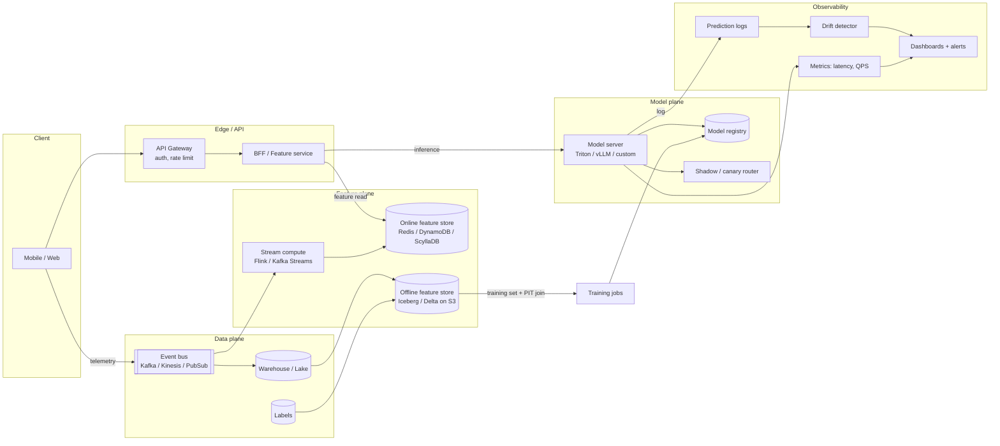

# Reference architecture — online ML system

The canonical online ML system. Referenced by modules 02, 04, 07, 08, 09, 10, 11, 14, 15.

## The eight roles in this picture

| # | Role | Why it exists |
|---|------|---------------|
| 1 | **API gateway** | Auth, rate limit, schema validation. Don't put model code behind a service that doesn't have this — you'll regret it the first time a buggy client floods you. |
| 2 | **BFF / Feature service** | Composes feature reads and the model call. Often where personalisation logic lives. |
| 3 | **Online feature store** | Low-latency key-value reads at request time. Single-digit-ms p99 or you blow the latency budget. |
| 4 | **Offline feature store** | Training data + backfills. The same logical features as online, computed and stored differently. |
| 5 | **Stream compute** | Computes fresh features from event streams; writes to the online store. |
| 6 | **Model server** | Loads versioned models from the registry; serves inference. |
| 7 | **Event bus + warehouse** | Truth log; the source of training data, labels, and drift signals. |
| 8 | **Observability** | Latency, prediction logs, drift, alerts. The thing you wish you'd built sooner. |

## Three load-bearing invariants

1. **One feature definition, two stores.** Offline and online compute paths must produce numerically identical features for the same (entity, timestamp). See [Module 02](../02-feature-stores/README.md).
2. **Predictions are logged.** Every prediction with the features used, the model version, and a request id. This is the only way to debug drift, fairness, and regressions. See [Module 10](../10-monitoring-and-drift/README.md).
3. **Models are versioned at the binary, not the code commit.** Two runs of the same training code produce different models. Treat the binary as the unit. See [Module 11](../11-mlops-and-ci-cd/README.md).

## What this picture omits

- **Training compute.** The arrow into `TRAIN` hides a GPU cluster. See [Module 03](../03-training-infra/README.md).
- **Retrieval layer.** For recsys / search, there is a candidate-generation stage upstream of the ranker. See [`diagrams-shared/recsys-two-stage.md`](./recsys-two-stage.md).
- **Multi-region.** Assume each region has the full picture; a control plane reconciles model versions and feature definitions across regions.
- **Cost telemetry.** Cost-per-request lives in the observability box but is rarely instrumented from day one. See [Module 12](../12-cost-multitenancy-scaling/README.md).

## Sources

- "Meet Michelangelo: Uber's Machine Learning Platform" (Uber Engineering, 2017).
- "Scaling Machine Learning at Stripe" (Stripe Engineering, 2023).
- "Real-time Machine Learning at Pinterest" (Pinterest Engineering, 2022).
- *Designing Machine Learning Systems*, Huyen (O'Reilly, 2022), chapter 7.
