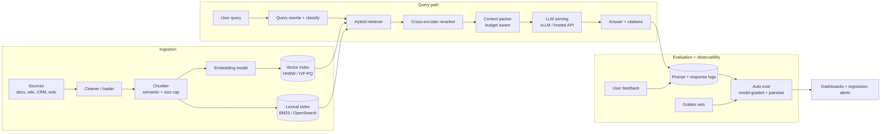

# Reference architecture — RAG

The canonical retrieval-augmented generation system. Referenced by modules 05, 06, 14, 15.

## Seven decisions that determine RAG quality

| Decision | Where it lives | Cheap default |
|----------|----------------|---------------|
| **Chunk size and overlap** | `CHUNK` | 500-1000 tokens, 10-20 percent overlap. Tune by eval. |
| **Embedding model** | `EMB` | A strong open model (e.g., BGE, E5) or a hosted one (OpenAI, Cohere, Voyage). |
| **Index type** | `IDX` | HNSW for hot data, IVF-PQ for cold or huge corpora. See [Module 05](../05-vector-dbs-and-retrieval/README.md). |
| **Hybrid retrieval** | `RET` | BM25 + vector; reciprocal rank fusion. Pure vector loses on rare-term queries. |
| **Reranker** | `RERANK` | Cross-encoder over the top 50-200 candidates. Expensive but huge accuracy lift. |
| **Context packing** | `CTX` | Order by relevance, fit within token budget, leave headroom for the generation. |
| **Eval as infra** | `EVAL` | Golden set + model-graded + pairwise. Run on every prompt/model change. See [Module 06](../06-llm-serving-and-rag/README.md). |

## The three failure modes everyone hits

1. **Embedding lock-in.** You change embedding models and now your million-document index is wrong. Re-embedding is hours-to-days and expensive; plan for it before you commit to a model. See [Module 06](../06-llm-serving-and-rag/README.md).
2. **Lost-in-the-middle (Liu et al., 2023).** LLMs underweight content in the middle of long contexts. Long contexts are not a free lunch; relevance order matters.
3. **No eval harness.** Every prompt tweak feels like an improvement. Without golden sets and pairwise eval you'll regress in production within a month.

## Sources

- "Retrieval-Augmented Generation for Knowledge-Intensive NLP Tasks," Lewis et al. (NeurIPS 2020).
- "Lost in the Middle: How Language Models Use Long Contexts," Liu et al. (TACL 2023).
- "Efficient Memory Management for Large Language Model Serving with PagedAttention," Kwon et al. (vLLM, SOSP 2023).
- Anthropic prompt caching documentation (current).
