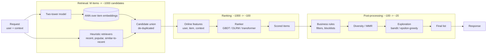

# Reference architecture — recsys two-stage

The canonical retrieval -> ranking -> filtering recommender. Referenced by modules 04, 07, 08, 14, 15.

## Why two stages

A recommender at scale sees hundreds of millions of items and must respond in tens of milliseconds. You cannot score every item with a heavy model. So:

| Stage | Items | Latency budget | Model |
|-------|-------|----------------|-------|
| **Retrieval** | 10^7 -> 10^3 | ~10-20 ms | Cheap. Two-tower ANN, heuristic, popularity. Optimize recall@k. |
| **Ranking** | 10^3 -> 10^2 | ~30-80 ms | Heavy. GBDT or DLRM with rich features. Optimize NDCG / engagement. |
| **Post-processing** | 10^2 -> 10^1 | ~5-10 ms | Rules, diversity, exploration. Optimize long-term value. |

## Three load-bearing decisions

1. **Same embedding space across retrievers.** If two-tower and "similar-to-recent" use different embedding models, the union has unpredictable coverage. Pick one.
2. **Feature parity at training and serving.** The ranker's online features must match what was logged for training. Otherwise: train-serve skew. See [Module 00](../00-foundations/README.md) and [Module 02](../02-feature-stores/README.md).
3. **Exploration is part of the system, not a bolt-on.** If you only ever serve what the ranker likes most, you starve the feedback loop and the model decays. See [Module 07](../07-recommendation-systems/README.md).

## Sources

- "Deep Neural Networks for YouTube Recommendations," Covington et al. (RecSys 2016).
- "Graph Convolutional Neural Networks for Web-Scale Recommender Systems," Ying et al. (Pinterest, KDD 2018). PinSage.
- "Sampling-Bias-Corrected Neural Modeling for Large Corpus Item Recommendations," Yi et al. (Google, RecSys 2019).
- "Instagram's Explore Recommender System" (Meta Engineering, 2023).
